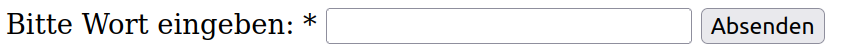

<style>
  code {
    color: #050 !important;
  }
</style>

# Klausur Web-Applikationen SS 2022

<br/>

Name:

<br/>

Matrikelnummer:

<br/><br/><br/>

| Aufgabe  | -1- | -2- | -3- | -4- | -5- | -6- | -7- |
| -------- | --- | --- | --- | --- | --- | --- | --- |
| Punkte   | 25  | 7   | 6   | 22  | 7   | 9   | 14  |
| erreicht |     |     |     |     |     |     |     |

Summe (max. 90 Punkte):

Note:

<br/><br/><br/>

Zeit: 90 Minuten

Erlaubte Hilfsmittel: ein DIN-A4-Blatt mit eigenen Notizen (beidseitig)

**Viel Erfolg!**

<div class="page"/>

## Aufgabe 1 (HTML & JavaScript) (25 Punkte)

Skizzieren Sie den zum HTML-Code zugehörigen DOM-Tree (ohne Text-Knoten). **(4 Punkte)**

```
<html lang="en">
  <head>
    <meta charset="UTF-8" />
    <title>Addierer</title>
  </head>
  <body>
    <main>
      <h2>Addierer</h2>
      <form>
        <fieldset>
          <input type="number" name="first" id="first" />
          <input type="number" name="second" id="second" />
        </fieldset>
        <input type="submit" id="calc" value="" />
      </form>
      <p>
        Die Summe lautet:
        <span id="result"></span>
      </p>
    </main>
    <script>
      // add first and second
      const add = () => {};
    </script>
  </body>
</html>
```

DOM-Tree:

<div class="page"/>

Im `<script>`-Tag befindet sich eine unvollständige JavaScript Funktion `add()`. Implementieren Sie diese, sodass `add()`

- die Zahlen in den Eingabefeldern des Formulars addiert (Hinweis: auch bei `type="number"` sind Eingaben zunächst vom Datentyp `string`)
- die Summe auf zwei Nachkommastellen mit Hilfe der builtin-Funktion `.toFixed(2)` kürzt (z.B. `5.759.toFixed(2)` liefert `"5.76"`)
- das Ergebnis als Rückgabewert ausgibt (Datentyp `number` oder `string`)

**(8 Punkte)**

`const add = () => {`

<br/><br/><br/><br/><br/><br/><br/><br/><br/>

`}`

Der nachfolgende Code setzt einen Klick-Listener auf den Submit-Button. Im Callback soll die nun mit `add()` korrekt berechnete Summe unter dem Formular angezeigt werden. Warum wird dies nicht wie gewünscht funktionieren? Was muss an welcher Stelle dem Code hinzugefügt werden, damit es funktioniert? **(3 Punkte)**

```
const calc = document.getElementById("calc");
calc.addEventListener("click", function (e) {
    const sum = add();
    document.getElementById("result").innerHTML = sum;
  },
  false
);
```

<div class="page"/>

Erläutern Sie den Begriff "Barrierefreiheit" in Bezug auf das World Wide Web in 2-3 Sätzen. Beschreiben Sie zwei Wege, das HTML-Dokument zu Beginn dieser Aufgabe diesbezüglich zu verbessern. **(6 Punkte)**

<br/><br/><br/><br/><br/><br/><br/><br/><br/><br/><br/><br/><br/><br/><br/><br/><br/><br/>

Wordle ist ein Spiel, bei dem ein Wort mit fünf Buchstaben erraten wird. Sie wollen einen Prototyp davon implementieren, für den Sie ein HTML-Formular verwenden. Schreiben Sie den für den unten stehenden Screenshot benötigten HTML-Code innerhalb von `<form>`. Das Eingabefeld ist ein Pflichtfeld. **(4 Punkte)**



`<form>`
<br/><br/><br/><br/><br/><br/><br/><br/><br/><br/><br/><br/><br/><br/><br/>
`</form>`

<div class="page"/>

## Aufgabe 2 (HTTP & WWW) (7 Punkte)

Vervollständigen Sie die Tabelle mit den numerischen HTTP-Statuscodes der gegebenen Nachrichten.<br/>
**(3 Punkte)**

| Nachricht             | Statuscode |
| --------------------- | ---------- |
| OK                    |            |
| Internal Server Error |            |
| Unauthorized          |            |

`Authorization` und `Cookie` sind zwei Beispiele für HTTP-Request-Felder. Nennen Sie zwei weitere.<br/>
**(2 Punkte)**

<br/><br/><br/><br/><br/><br/>

Die folgende URL verweist auf die Episodenliste der Serie "Breaking Bad" auf Wikipedia. Wofür steht "#Episodenliste" und was muss im HTML-Dokument existieren, damit die URL wie gewünscht funktioniert. **(2 Punkte)**

https://de.wikipedia.org/wiki/Breaking_Bad#Episodenliste

<div class="page"/>

## Aufgabe 3 (JSON) (6 Punkte)

Das folgende JSON ist nicht valide. Markieren Sie die vier fehlerhaften Stellen und beschreiben Sie stichwortartig, welche Änderung jeweils getätigt werden muss. **(6 Punkte)**

<br/><br/><br/><br/><br/><br/><br/>

```
[
  "name": "Hochschule Fulda",
  "street": "Leipziger Straße",
  "houseNumber": "123",
  "postalCode": parseInt("36037"),
  "city": "Fulda",
  "employees": [
    {
      "firstName": "D.",
      "lastName": "Biezā",
      "number": 3050,
      "responsibilities": {"AI-Support", "Betreuung Software-Labore"}
    },
    {
      "firstName": "C.",
      "lastName": "Pape",
      "number": 379,
      "responsibilities": ["Betreuung WI-Labor", "Virtualisierung"]
    },
  ],
  "hasLibrary": true,
  "students": 9300
]
```

<div class="page"/>

## Aufgabe 4 (CSS) (22 Punkte)

Nennen und beschreiben Sie 3 CSS Eigenschaften (CSS properties). **(4 Punkte)**

<br/><br/><br/><br/><br/><br/><br/><br/><br/><br/><br/><br/><br/><br/>

Nennen Sie eine CSS-Eigenschaft, die nicht an ein Kindelement vererbt wird. **(1 Punkt)**

<br/><br/><br/>

Skizzieren Sie das CSS-Boxmodell. Benennen und markieren Sie dabei die vier Komponenten. **(5 Punkte)**

<div class="page"/>

Diese Code-Ausschnitte sind für die nächsten zwei Teilaufgaben.

```
<body>
  <main>
    <h1>Orte</h1>
    <div class="landscape">
      <p id="meadow" class="green">Wiese</p>
      <p id="forest" class="green">Wald</p>
      <p id="river" class="blue">Fluss</p>
    </div>
    <div class="city">
      <p id="house" class="yellow">Haus</p>
      <p id="street" class="grey">Straße</p>
    </div>
  </main>
</body>
```

CSS:

```
main {
  color: pink;
}

.landscape {
  color: yellow;
}

.green {
  color: blue;
}

p:first-child {
  color: red;
}

.house {
  color: black;
}

#street {
  padding: 0;
}

p {
  color: orange;
}
```

<div class="page"/>

Betrachten Sie den `<body>` eines HTML-Dokuments auf der vorherigen Seite. In welcher Farbe (Englisch) erscheinen die Wörter auf der Webseite, wenn das Stylesheet angewandt wird? <br/>
**(9 Punkte)**

| Wort   | Farbe |
| ------ | ----- |
| Orte   |       |
| Wiese  |       |
| Wald   |       |
| Fluss  |       |
| Haus   |       |
| Straße |       |

Nennen Sie drei CSS-Selektoren, um in dem HTML-Dokument **nur** das Element mit dem Text "Wald" zu selektieren. **(3 Punkte)**

<div class="page"/>

## Aufgabe 5 (Reguläre Ausdrücke) (7 Punkte)

Nennen Sie 3 Strings mit einem Match zu dem regulären Ausdruck (JavaScript):<br/>`^[Mm]ah?l(en|)$`<br/> **(3 Punkte)**

<br/><br/><br/><br/><br/><br/><br/><br/><br/><br/>

Zusatzstoffe in Lebensmitteln werden in Europa mit sogenannten "E-Nummern" gekennzeichnet. Das Format ist der Großbuchstabe `E`, gefolgt von einem Leerzeichen, gefolgt von einer Ziffernfolge.

Farbstoffe haben die E-Nummern `E 100` bis `E 199`. Erstellen Sie einen regulären Ausdruck (JavaScript), um Farbstoffe in einer Zutatenliste zu finden.

Bei Strings wie `E 1111` oder `BE 111` soll der reguläre Ausdruck nicht matchen. **(4 Punkte)**

<div class="page"/>

## Aufgabe 6 (Ajax) (9 Punkte)

Zeichnen Sie ein Diagramm, welches die folgenden Interaktionen im Zeitverlauf in einem Client-Server-Modell veranschaulicht. Kennzeichnen Sie dabei die Zeiträume, in denen der Client nicht mit der Webseite interagieren kann.

- Eingabe von "https://hs-fulda.de" in den Browser
- Klick auf "Angewandte Informatik" lädt per Ajax Teile der Seite neu
- Klick auf "Termine" lädt per Ajax Teile der Seite neu
- Klick auf "Absenden" sendet ein Formular ab und lädt eine neue Seite

**(5 Punkte)**

<br/><br/><br/><br/><br/><br/><br/><br/><br/><br/><br/><br/><br/><br/><br/><br/><br/>

Beschreiben Sie zwei Vorteile eines asynchronen Datenflusses gegenüber eines synchronen Datenflusses? **(4 Punkte)**

<div class="page"/>

## Aufgabe 7 (Objektorientierung) (14 Punkte)

Der folgende Code-Ausschnitt ist für die nächsten zwei Teilaufgaben.

```
const Room = function (name, squareMeters) {
  this.name = name;
  this.squareMeters = squareMeters;
};
Room.prototype.openWindow = function () {
  console.log(`opening window in ${this.name}`);
};
Room.prototype.isLarge = function () {
  return this.squareMeters > 20;
};

class LivingRoom extends Room {
  isTvOn = true;

  constructor(name, squareMeters, pillows) {
    super(name, squareMeters);
    this.pillows = pillows;
  }
}

class BathRoom extends Room {
  constructor(name, squareMeters, hasBathtub) {
    super(name, squareMeters);
    this.hasBathtub = hasBathtub;
  }

  needABath() {
    console.log(this.hasBathtub ? "open the faucet" : "go swimming");
  }
}

const bathRoom = new BathRoom("bath", 15, true);
const livingRoom = new LivingRoom("living room", 21, 7);

console.log(livingRoom.squareMeters);
bathRoom.hasBathtub = false;
bathRoom.needABath();
bathRoom.openWindow();
console.log(livingRoom.isLarge());
console.log(!livingRoom.isTvOn);
console.log(bathRoom.pillows);
```

<div class="page"/>

Betrachten Sie den objektorientieren Entwurf für Räume in einem Haus. Schreiben Sie die 6 Zeilen auf, die bei Ausführung des Codes auf die Konsole geloggt werden. **(6 Punkte)**

<br/><br/><br/><br/><br/><br/><br/><br/><br/><br/><br/>

Entwerfen Sie eine weitere Klasse `Basement` (Keller), die von `Room` erbt. Ein Keller hat die Eigenschaften `name` und `squareMeters`, außerdem noch `windows` für die Anzahl an Fenstern. Wenn der Keller mindestens ein Fenster hat, soll sich `openWindow()` wie bereits implementiert verhalten. Sollte ein Keller keine Fenster haben, soll `openWindow()` stattdessen `no window available` ausloggen.

Sie können für diese Aufgabe ES5 oder ES6 Schreibweise verwenden. **(8 Punkte)**

<div class="page"/>

## Zusatzblatt
