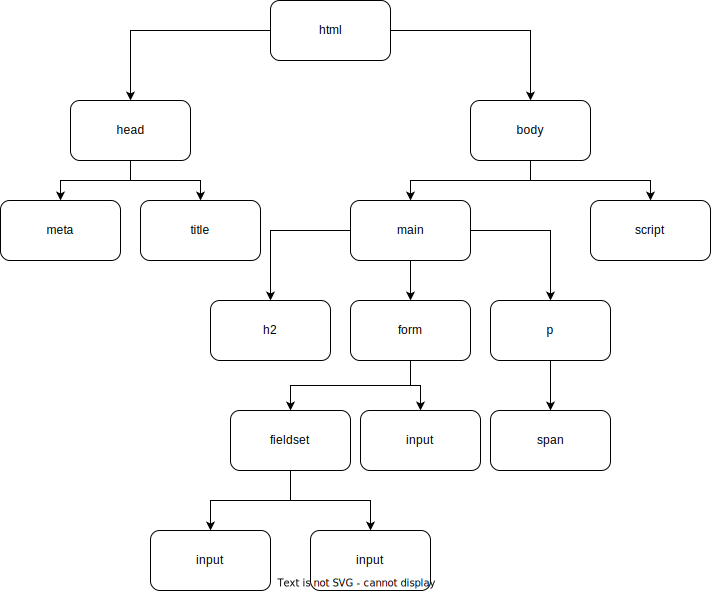
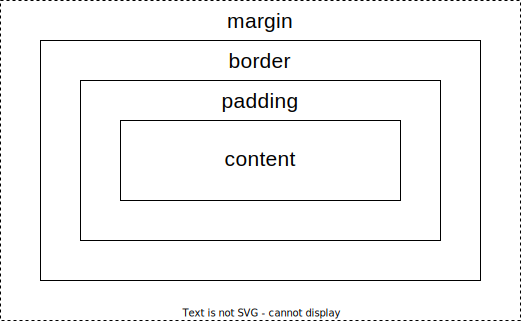
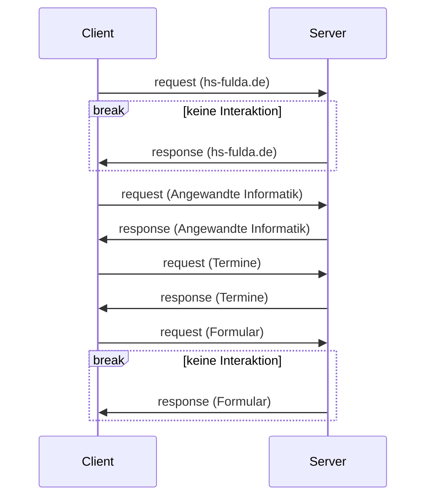

<style>
  .solution {
    color: #993333;
    font-size: 0.8em;
  }
  .code {
    font-family: monospace;
  }
  code {
    color: #050 !important;
  }

  code.solution {
    color: #993333 !important;
  }

  svg[id^="mermaid-"] { max-height: 500px; }
</style>

# Klausur Web-Applikationen

<br/>

Name:

<br/>

Matrikelnummer:

<br/><br/><br/>

| Aufgabe  | -1- | -2- | -3- | -4- | -5- | -6- | -7- |
| -------- | --- | --- | --- | --- | --- | --- | --- |
| Punkte   | 25  | 7   | 6   | 22  | 7   | 9   | 14  |
| erreicht |     |     |     |     |     |     |     |

Summe (max. 90 Punkte):

Note:

<br/><br/><br/>

Zeit: 90 Minuten

Erlaubte Hilfsmittel: ein DIN-A4-Blatt mit eigenen Notizen (beidseitig)

**Viel Erfolg!**

<div class="page"/>

## Aufgabe 1 (HTML & JavaScript) (25 Punkte)

Skizzieren Sie den zum HTML-Code zugehörigen DOM-Tree (ohne Text-Knoten). (4 Punkte)

```
<html lang="en">
  <head>
    <meta charset="UTF-8" />
    <title>Addierer</title>
  </head>
  <body>
    <main>
      <h2>Addierer</h2>
      <form>
        <fieldset>
          <input type="number" name="first" id="first" />
          <input type="number" name="second" id="second" />
        </fieldset>
        <input type="submit" id="calc" value="" />
      </form>
      <p>
        Die Summe lautet:
        <span id="result"></span>
      </p>
    </main>
    <script>
      // add first and second
      const add = () => {};
    </script>
  </body>
</html>
```

DOM-Tree:



<div class="page"/>

Im `<script>`-Tag befindet sich eine unvollständige JavaScript Funktion `add()`. Implementieren Sie diese, sodass `add()`

- die Zahlen in den Eingabefeldern des Formulars addiert (Hinweis: auch bei `type="number"` sind Eingaben zunächst vom Datentyp `string`)
- die Summe auf zwei Nachkommastellen mit Hilfe der builtin-Funktion `.toFixed(2)` kürzt (z.B. `5.759.toFixed(2)` liefert `"5.76"`)
- das Ergebnis als Rückgabewert ausgibt (Datentyp `number` oder `string`)

(8 Punkte)

`const add = () => {`

<div class="solution code">
<div>const firstValue = document.getElementById("first").value;</div>
<div>const secondValue = document.getElementById("second").value;</div>
<div>const sum = parseFloat(firstValue) + parseFloat(secondValue);</div>   
<div>return sum.toFixed(2);</div>
</div>

`}`

<br/>

Der nachfolgende Code setzt einen Klick-Listener auf den Submit-Button. Im Callback soll die nun mit `add()` korrekt berechnete Summe unter dem Formular angezeigt werden. Warum wird dies nicht wie gewünscht funktionieren? Was muss an welcher Stelle dem Code hinzugefügt werden, damit es funktioniert? (3 Punkte)

```
const calc = document.getElementById("calc");
calc.addEventListener(
  "click",
  function (e) {
    const sum = add();
    document.getElementById("result").innerHTML = sum;
  },
  false
);
```

<div class="solution">
  Die Standardaktion beim Klick auf einen Button vom Typ <span class="code">submit</span> ist das Absenden des Formulars. In diesem Zuge lädt der Browser die Seite neu, wodurch der zum <span class="code">span</span>-Element hinzugefügte Text wieder verschwindet. Das Standardverhalten kann unterdrückt werden, indem man <span class="code">e.preventDefault()</span> zur callback Funktion hinzufügt.
</div>

<div class="page"/>

Erläutern Sie den Begriff "Barrierefreiheit" in Bezug auf das World Wide Web in 2-3 Sätzen. Beschreiben Sie zwei Wege, das HTML-Dokument zu Beginn dieser Aufgabe diesbezüglich zu verbessern. (6 Punkte)

<div class="solution">
<p>
Menschen haben nicht das gleiche Seh- und Hörvermögen, unterscheiden sich in kognitiven Fähigkeiten, Bewegungsmöglichkeiten, aber auch im Zugang zu Hard- und Software. Barrierefreiheit bedeutet Webseiten so zu gestalten, dass sie trotz aller Unterschiede von so vielen Menschen wie möglich genutzt werden können.
</p>
<p>Verbesserungsmöglichkeiten: (2 genügen)</p>
<ul>
<li>Attribut <span class="code">lang</span> auf <span class="code">lang=de</span> umstellen, z.B. für korrekte Aussprache der deutschen Texte bei Screenreadern</li>
<li><span class="code">value</span> des Submit-Buttons nicht leer lassen, um Aktion zu kennzeichnen</li>
<li>ein <span class="code">&lt;legend&gt;</span>-Tag zum <span class="code">&lt;fieldset&gt;</span> hinzufügen, um Informationen zur Gruppierung der Eingabefelder bereit zu stellen</li>
<li>ein <span class="code">&lt;label&gt;</span>-Tag für die ersten beiden Eingabefelder hinzufügen, um den Zweck der Formularelemente zu beschreiben</li>
<li>input <span class="code">type="reset"</span> hinzufügen für einfacheres Zurücksetzen</li>
<li>Titel mit <span class="code">&lt;title&gt;</span> hinzufügen, der die Inhalte der Seite zusammenfasst</li>
<li><span class="code">&lt;h2&gt;</span> in <span class="code">&lt;h1&gt;</span> ändern: ein <span class="code">&lt;h2&gt;</span>-Tag ohne ein <span class="code">&lt;h1&gt;</span>-Tag kann bei der Navigation der Seite verwirrend sein</li>
<li>Texte in andere Sprachen übersetzen</li>
<li>CSS media queries verwenden, um verschiedene Displaygrößen zu unterstützen</li>
</ul>
</div>

Wordle ist ein Spiel, bei dem ein Wort mit fünf Buchstaben erraten wird. Sie wollen einen Prototyp davon implementieren, für den Sie ein HTML-Formular verwenden. Schreiben Sie den für den unten stehenden Screenshot benötigten HTML-Code innerhalb von `<form>`. Das Eingabefeld ist ein Pflichtfeld. (4 Punkte)


`<form>`

<div class="solution code">
  <div>&lt;label for="word"&gt;Bitte Wort eingeben: *&lt;/label&gt;</div>
  <div>&lt;input type="text" name="word" id="word" maxlength="5" minlength="5" required /&gt;</div>
  <div>&lt;input type="submit" value="Absenden" /&gt;</div>
</div>

`</form>`

<div class="solution">(min/maxlength optional)</div>

<div class="page"/>

## Aufgabe 2 (HTTP & WWW) (7 Punkte)

Vervollständigen Sie die Tabelle mit den numerischen HTTP-Statuscodes der gegebenen Nachrichten.<br/>
(3 Punkte)

| Nachricht             | Statuscode                        |
| --------------------- | --------------------------------- |
| OK                    | <span class="solution">200</span> |
| Internal Server Error | <span class="solution">500</span> |
| Unauthorized          | <span class="solution">401</span> |

`Authorization` und `Cookie` sind zwei Beispiele für HTTP-Request-Felder. Nennen Sie zwei weitere.<br/>
(2 Punkte)

<p class="solution">
  Host, User-Agent, Content-Type, Accept, Date,...
</p>

Die folgende URL verweist auf die Episodenliste der Serie "Breaking Bad" auf Wikipedia. Wofür steht "#Episodenliste" und was muss im HTML-Dokument existieren, damit die URL wie gewünscht funktioniert. (2 Punkte)

https://de.wikipedia.org/wiki/Breaking_Bad#Episodenliste

<div class="solution">
  "#Episodenliste" ist Fragment/Anker und stellt eine Referenz auf eine bestimmte Stelle in der Resource dar. Im HTML-Dokument muss die entsprechende Sprungmarke existieren, z.B. <span class="code">&lt;div id="Episodenliste"&gt;</span> oder <span class="code">&lt;a name="Episodenliste"&gt;</span>
</div>

<div class="page"/>

## Aufgabe 3 (JSON) (6 Punkte)

Das folgende JSON ist nicht valide. Markieren Sie die vier fehlerhaften Stellen und beschreiben Sie stichwortartig, welche Änderung jeweils getätigt werden muss. (6 Punkte)

<div class="solution">
  <ul>
    <li>äußere Klammern durch "{}" ersetzen, da Objekt</li>
    <li>Funktionsaufruf "parseInt" nicht möglich -> Wert ändern zu: 36037</li>
    <li>"responsibilities" bei erstem Mitarbeiter als Array []</li>
    <li>Komma nach zweitem Mitarbeiter entfernen</li>
  </ul>
</div>

```
[
  "name": "Hochschule Fulda",
  "street": "Leipziger Straße",
  "houseNumber": "123",
  "postalCode": parseInt("36037"),
  "city": "Fulda",
  "employees": [
    {
      "firstName": "D.",
      "lastName": "Biezā",
      "number": 3050,
      "responsibilities": {"AI-Support", "Betreuung Software-Labore"}
    },
    {
      "firstName": "C.",
      "lastName": "Pape",
      "number": 379,
      "responsibilities": ["Betreuung WI-Labor", "Virtualisierung"]
    },
  ],
  "hasLibrary": true,
  "students": 9300
]
```

<div class="page"/>

## Aufgabe 4 (CSS) (22 Punkte)

Nennen und beschreiben Sie 3 CSS Eigenschaften (CSS properties). (4 Punkte)

<div class="solution">
  <ul>
    <li>background-color: setzt die Hintergrundfarbe eines Elements, z.B. durch einen Hexcode #f4aa12</li>
    <li>margin-top: spezifiziert den oberen, äußeren Abstand eines Elements, z.B. durch einen px-Wert</li>
    <li>font-size: legt die Schriftgröße fest, z.B. durch einen em-Wert oder ein Schlüsselwort wie large</li>
  </ul>
</div>

Nennen Sie eine CSS-Eigenschaft, die nicht an ein Kindelement vererbt wird. (1 Punkt)

<p class="solution">
    background-color, border, width, height, padding, margin, position, float, transition, display, grid-row, content, box-shadow, border-radius, left, align-self,...
</p>

Skizzieren Sie das CSS-Boxmodell. Benennen und markieren Sie dabei die vier Komponenten. (5 Punkte)



<div class="page"/>

Diese Code-Ausschnitte sind für die nächsten zwei Teilaufgaben.

```
<body>
  <main>
    <h1>Orte</h1>
    <div class="landscape">
      <p id="meadow" class="green">Wiese</p>
      <p id="forest" class="green">Wald</p>
      <p id="river" class="blue">Fluss</p>
    </div>
    <div class="city">
      <p id="house" class="yellow">Haus</p>
      <p id="street" class="grey">Straße</p>
    </div>
  </main>
</body>
```

CSS:

```
main {
  color: pink;
}

.landscape {
  color: yellow;
}

.green {
  color: blue;
}

p:first-child {
  color: red;
}

.house {
  color: black;
}

#street {
  padding: 0;
}

p {
  color: orange;
}
```

<div class="page"/>

Betrachten Sie den `<body>` eines HTML-Dokuments auf der vorherigen Seite. In welcher Farbe (Englisch) erscheinen die Wörter auf der Webseite, wenn das Stylesheet angewandt wird? <br/>
(9 Punkte)

| Wort   | Farbe                                |
| ------ | ------------------------------------ |
| Orte   | <span class="solution">pink</span>   |
| Wiese  | <span class="solution">red</span>    |
| Wald   | <span class="solution">blue</span>   |
| Fluss  | <span class="solution">orange</span> |
| Haus   | <span class="solution">red</span>    |
| Straße | <span class="solution">orange</span> |

Nennen Sie drei CSS-Selektoren, um in dem HTML-Dokument **nur** das Element mit dem Text "Wald" zu selektieren. (3 Punkte)

<div class="solution code">#forest</div>
<div class="solution code">p#forest</div>
<div class="solution code">.green#forest</div>
<div class="solution code">#forest.green</div>
<div class="solution code">#meadow + p</div>
<div class="solution code">.green + #forest</div>
<div class="solution code">.green ~ #forest</div>
<div class="solution code">.green ~ .green</div>
<div class="solution code">p + #forest</div>
<div class="solution code">p ~ #forest</div>
<div class="solution code">.landscape > #forest</div>
<div class="solution code">div > #forest</div>
<div class="solution code">.green:nth-child(2)</div>
<div class="solution code">p.green:nth-child(2)</div>
<div class="solution code">.landscape > p:nth-child(2)</div>
<div class="solution code">p[id='forest']</div>
<div>...</div>

<div class="page"/>

## Aufgabe 5 (Reguläre Ausdrücke) (7 Punkte)

Nennen Sie 3 Strings mit einem Match zu dem regulären Ausdruck (JavaScript):<br/>`^[Mm]ah?l(en|)$`<br/> (3 Punkte)

<div class="solution">
  <ul>
    <li>malen</li>
    <li>mahlen</li>
    <li>Malen</li>
    <li>Mahlen</li>
    <li>Mal</li>
    <li>Mahl</li>
  </ul>
</div>

Zusatzstoffe in Lebensmitteln werden in Europa mit sogenannten "E-Nummern" gekennzeichnet. Das Format ist der Großbuchstabe `E`, gefolgt von einem Leerzeichen, gefolgt von einer Ziffernfolge.

Farbstoffe haben die E-Nummern `E 100` bis `E 199`. Erstellen Sie einen regulären Ausdruck (JavaScript), um Farbstoffe in einer Zutatenliste zu finden.

Bei Strings wie `E 1111` oder `BE 111` soll der reguläre Ausdruck nicht matchen. (4 Punkte)

<div class="solution code">
<ul>
<li>^E 1[0-9][0-9]$</li>
<li>^E 1[0-9]{2}$</li>
<li>^E[ ]1\d{2}$</li>
<li>^(E 1)[0-9]{2}$</li>
</ul>
</div>

<div class="page"/>

## Aufgabe 6 (Ajax) (9 Punkte)

Zeichnen Sie ein Diagramm, welches die folgenden Interaktionen im Zeitverlauf in einem Client-Server-Modell veranschaulicht. Kennzeichnen Sie dabei die Zeiträume, in denen der Client nicht mit der Webseite interagieren kann.

- Eingabe von "https://hs-fulda.de" in den Browser
- Klick auf "Angewandte Informatik" lädt per Ajax Teile der Seite neu
- Klick auf "Termine" lädt per Ajax Teile der Seite neu
- Klick auf "Absenden" sendet ein Formular ab und lädt eine neue Seite

(5 Punkte)



Beschreiben Sie zwei Vorteile eines asynchronen Datenflusses gegenüber eines synchronen Datenflusses? (4 Punkte)

<div class="solution">
<ul>
<li>mehrere Anfragen können gleichzeitig versendet werden</li>
<li>einzelne Schritte können in unterschiedlicher Reihenfolge erfolgen</li>
<li>unabhängige Programmteile müssen nicht auf eine Antwort warten (das UI bleibt responsive)</li>
</ul>
</div>

<div class="page"/>

## Aufgabe 7 (Objektorientierung) (14 Punkte)

Der folgende Code-Ausschnitt ist für die nächsten zwei Teilaufgaben.

```
const Room = function (name, squareMeters) {
  this.name = name;
  this.squareMeters = squareMeters;
};
Room.prototype.openWindow = function () {
  console.log(`opening window in ${this.name}`);
};
Room.prototype.isLarge = function () {
  return this.squareMeters > 20;
};

class LivingRoom extends Room {
  isTvOn = true;

  constructor(name, squareMeters, pillows) {
    super(name, squareMeters);
    this.pillows = pillows;
  }
}

class BathRoom extends Room {
  constructor(name, squareMeters, hasBathtub) {
    super(name, squareMeters);
    this.hasBathtub = hasBathtub;
  }

  needABath() {
    console.log(this.hasBathtub ? "open the faucet" : "go swimming");
  }
}

const bathRoom = new BathRoom("bath", 15, true);
const livingRoom = new LivingRoom("living room", 21, 7);

console.log(livingRoom.squareMeters);
bathRoom.hasBathtub = false;
bathRoom.needABath();
bathRoom.openWindow();
console.log(livingRoom.isLarge());
console.log(!livingRoom.isTvOn);
console.log(bathRoom.pillows);
```

<div class="page"/>

Betrachten Sie den objektorientieren Entwurf für Räume in einem Haus. Schreiben Sie die 6 Zeilen auf, die bei Ausführung des Codes auf die Konsole geloggt werden. (6 Punkte)

<div class="solution code">
<p>21</p>
<p>go swimming</p>
<p>opening window in bath</p>
<p>true</p>
<p>false</p>
<p>undefined</p>
</div>

Entwerfen Sie eine weitere Klasse `Basement` (Keller), die von `Room` erbt. Ein Keller hat die Eigenschaften `name` und `squareMeters`, außerdem noch `windows` für die Anzahl an Fenstern. Wenn der Keller mindestens ein Fenster hat, soll sich `openWindow()` wie bereits implementiert verhalten. Sollte ein Keller keine Fenster haben, soll `openWindow()` stattdessen `no window available` ausloggen.

Sie können für diese Aufgabe ES5 oder ES6 Schreibweise verwenden. (8 Punkte)

<p class="solution">ES6-Syntax:</p>
<div class="solution code">
class Basement extends Room {<br/>
&nbsp;&nbsp;constructor(name, squareMeters, windows) {<br/>
&nbsp;&nbsp;&nbsp;&nbsp;super(name, squareMeters);<br/>
&nbsp;&nbsp;&nbsp;&nbsp;this.windows = windows;<br/>
&nbsp;&nbsp;}<br/>
<br/>
&nbsp;&nbsp;openWindow() {<br/>
&nbsp;&nbsp;&nbsp;&nbsp;if (this.windows < 1) {<br/>
&nbsp;&nbsp;&nbsp;&nbsp;&nbsp;&nbsp;console.log("no window available");<br/>
&nbsp;&nbsp;&nbsp;&nbsp;} else {<br/>
&nbsp;&nbsp;&nbsp;&nbsp;&nbsp;&nbsp;super.openWindow();<br/>
&nbsp;&nbsp;&nbsp;&nbsp;}<br/>
&nbsp;&nbsp;}<br/>
}<br/>
</div>

<div class="page"/>

<p class="solution">ES5-Syntax:</p>
<div class="solution code">
const Basement = function (name, squareMeters, windows) {<br/>
&nbsp;&nbsp;Room.call(this, name, squareMeters);<br/>
&nbsp;&nbsp;&nbsp;&nbsp;this.windows = windows;<br/>
&nbsp;&nbsp;};<br/>
<br/>
Basement.prototype = Object.create(Room.prototype);<br/>
Basement.prototype.constructor = Basement;<br/>
Basement.prototype.openWindow = function () {<br/>
&nbsp;&nbsp;if (this.windows < 1) {<br/>
&nbsp;&nbsp;&nbsp;&nbsp;console.log("no window available");<br/>
&nbsp;&nbsp;} else {<br/>
&nbsp;&nbsp;&nbsp;&nbsp;Room.prototype.openWindow.call(this);<br/>
&nbsp;&nbsp;}<br/>
};<br/>
<br/>
</div>

<p class="solution">Beispielhafter Aufruf:</p>
<div class="solution code">
const basement = new Basement("basement", 40, 1);<br/>
basement.openWindow();<br/>
</div>
