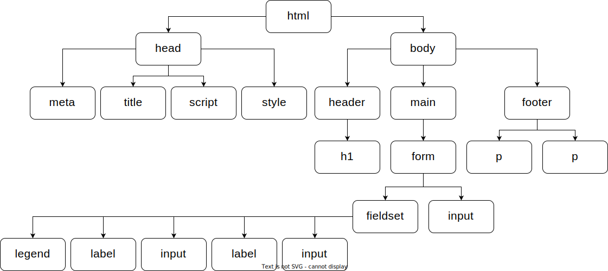
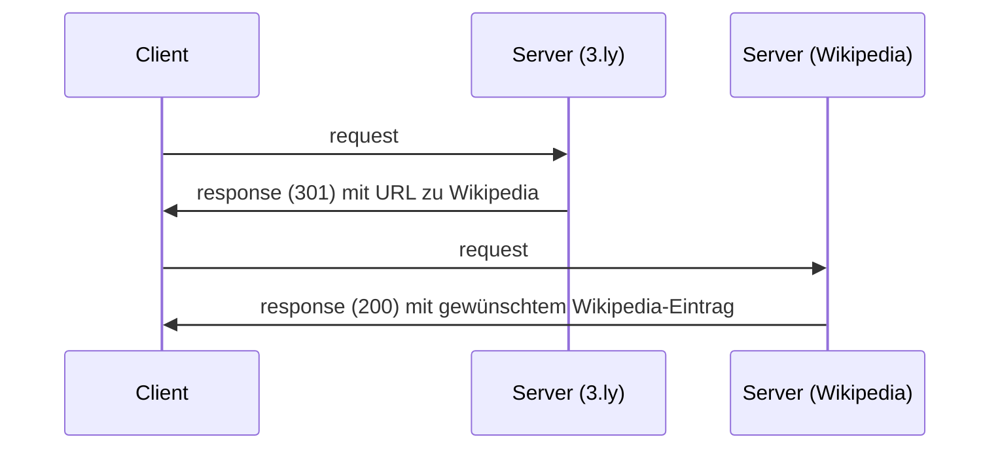
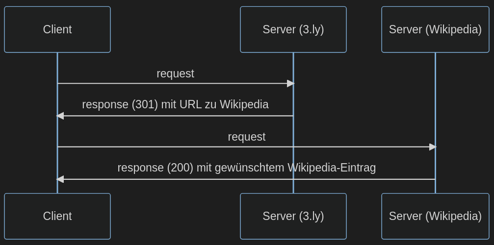
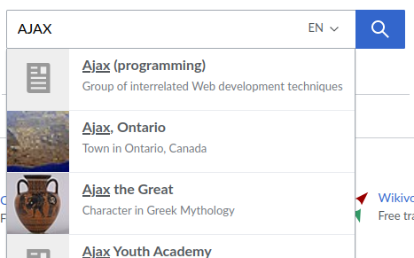

<style>
  .solution {
    color: #993333;
    font-size: 0.8em;
  }
  .code {
    font-family: monospace;
  }
  code {
    color: #050 !important;
  }

  code.solution {
    color: #993333 !important;
  }

  svg[id^="mermaid-"] { max-height: 500px; }
</style>

# Klausur Web-Applikationen WS 2022/2023

<br/>

Name:

<br/>

Matrikelnummer:

<br/><br/><br/>

| Aufgabe  | -1- | -2- | -3- | -4- | -5- | -6- | -7- |
| -------- | --- | --- | --- | --- | --- | --- | --- |
| Punkte   | 23  | 11  | 8   | 23  | 4   | 5   | 16  |
| erreicht |     |     |     |     |     |     |     |

Summe (max. 90 Punkte):

Note:

<br/><br/><br/>

Zeit: 90 Minuten

Erlaubte Hilfsmittel: ein DIN-A4-Blatt mit eigenen Notizen (beidseitig)

**Viel Erfolg!**

<div class="page"/>

## Aufgabe 1 (HTML & JavaScript) (23 Punkte)

Skizzieren Sie den zum HTML zugehörigen DOM-Tree (ohne Text-Knoten). Denken Sie daran, dass die Reihenfolge der Knoten eine Rolle spielt. **(5 Punkte)**

```
<html lang="en">
  <head>
    <meta charset="UTF-8" />
    <title>Wordle | Login</title>
    <script defer src="main.js"></script>
    <style>#secret { visibility: hidden; }</style>
  </head>
  <body>
    <header><h1>You need to login first</h1></header>
    <main>
      <form id="loginForm" action="https://wordle.de">
        <fieldset>
          <legend>Login</legend>
          <label for="username">Username</label>
          <input type="text" name="username" id="user" />
          <label for="password">Password</label>
          <input type="password" name="password" id="key" />
        </fieldset>
        <input type="submit" id="login" value="Login" />
      </form>
    </main>
    <footer>
      <p id="license">licensed under MIT</p>
      <p id="secret">Your password is 123456</p>
    </footer>
  </body>
</html>
```

DOM-Tree:



<div class="page"/>

Sie wollen am Ende des Formulars, d.h. direkt vor `</form>`, dynamisch via DOM-Manipulation (JavaScript) einen Reset-Button (`<input type="reset"/>`) hinzufügen. Auf dem Button soll der Text "Clear" stehen. Was schreiben Sie dazu in die Datei `main.js`?

Tipp: Nutzen Sie `createElement()`, `appendChild()`, sowie die Attribute `type` und `value`. **(6 Punkte)**

`main.js`:

<div class="solution code">
<div>const form = document.getElementById("loginForm");</div>
<div>const reset = document.createElement("input");</div>
<div>reset.type = "reset";</div>
<div>reset.value = "Clear";</div>
<div>form.appendChild(reset);</div>
</div>

<br/>

Das `<script>`-Tag hat das Attribut `defer`. Kreuzen Sie alle korrekten Aussagen an. **(2 Punkte)**

[x] Das Skript wird asynchron geladen.

[ ] Das Skript wird nur auf dem Server ausgeführt.

[x] Das Skript wird erst ausgeführt, wenn das HTML-Dokument vollständig geparst wurde.

<br/>

Unten stehend finden Sie einen anderen Code-Ausschnitt aus `main.js`. Was geschieht bei Aufruf dieses Codes, wenn `defer` auf `false` gesetzt wird (bzw. fehlt)? **(2 Punkte)**

```
// main.js
alert(document.getElementById("license").firstChild.nodeValue);
```

<div class="solution">
  Das HTML-Element mit der ID "license" steht noch nicht zur Verfügung. Somit wertet <span class="code">document.getElementById("license")</span> zu <span class="code">null</span> aus. Dies erzeugt einen Fehler, sodass keine Alert-Box erscheint.
</div>

In das Formular wird als Username `Maria` und als Passwort `123456` eingegeben. Welche URL (inklusive Query-String) wird beim Klicken auf `Login` aufgerufen? **(2 Punkte)**

<div class="solution code">
https://wordle.de/?username=Maria&password=123456
</div>

<div class="page"/>

Sie wollen nachfolgende Tabelle in ein HTML-Dokument übertragen. Schreiben Sie das hierfür notwendige HTML innerhalb des `<table>`-Tags. Verwenden Sie dabei auch die HTML-Elemente `thead` und `tbody`. Styling und Umrahmung können Sie außer Acht lassen. **(6 Punkte)**

| Nachricht             | Art          | Statuscode |
| --------------------- | ------------ | ---------- |
| OK                    | Success      | 200        |
| Unauthorized          | Client Error | 401        |
| Internal Server Error | Server Error | 500        |

`<table>`

<div class="solution code">
&lt;thead><br/>
&nbsp;&nbsp;&lt;tr><br/>
&nbsp;&nbsp;&nbsp;&nbsp;&lt;th>Nachricht&lt;/th><br/>
&nbsp;&nbsp;&nbsp;&nbsp;&lt;th>Art&lt;/th><br/>
&nbsp;&nbsp;&nbsp;&nbsp;&lt;th>Statuscode&lt;/th><br/>
&nbsp;&nbsp;&lt;/tr><br/>
&lt;/thead><br/>
&lt;tbody><br/>
&nbsp;&nbsp;&lt;tr><br/>
&nbsp;&nbsp;&nbsp;&nbsp;&lt;td>OK&lt;/td><br/>
&nbsp;&nbsp;&nbsp;&nbsp;&lt;td>Success&lt;/td><br/>
&nbsp;&nbsp;&nbsp;&nbsp;&lt;td>200&lt;/td><br/>
&nbsp;&nbsp;&lt;/tr><br/>
&nbsp;&nbsp;&lt;tr><br/>
&nbsp;&nbsp;&nbsp;&nbsp;&lt;td>Unauthorized&lt;/td><br/>
&nbsp;&nbsp;&nbsp;&nbsp;&lt;td>Client Error&lt;/td><br/>
&nbsp;&nbsp;&nbsp;&nbsp;&lt;td>401&lt;/td><br/>
&nbsp;&nbsp;&lt;/tr><br/>
&nbsp;&nbsp;&lt;tr><br/>
&nbsp;&nbsp;&nbsp;&nbsp;&lt;td>Internal Server Error&lt;/td><br/>
&nbsp;&nbsp;&nbsp;&nbsp;&lt;td>Server Error&lt;/td><br/>
&nbsp;&nbsp;&nbsp;&nbsp;&lt;td>500&lt;/td><br/>
&nbsp;&nbsp;&lt;/tr><br/>
&lt;/tbody><br/><br/>
</div>

`</table>`

<div class="page"/>

## Aufgabe 2 (HTTP & WWW) (11 Punkte)

`GET` ist ein Beispiel für eine HTTP-Anfragemethode (HTTP-Verb). Nennen Sie **zwei** weitere und beschreiben Sie diese in je einem Satz. **(4 Punkte)**

<div class="solution">
<ul>
<li>POST - hängt Daten an den Header an, um eine Ressource auf dem Server zu erstellen oder zu verändern.</li>
<li>DELETE - veranlasst das Löschen einer Ressource auf dem Server.</li>
</ul>
</div>

Ein sogenannter URL-Shortener kürzt URLs. Beispiel: bei Eingabe der URL `https://3.ly/amXxi` erfolgt eine Weiterleitung auf die URL `https://de.wikipedia.org/wiki/Breaking_Bad#Episodenliste`.

1. Nennen Sie einen Grund, weshalb jemand eine URL kürzen möchte. **(1 Punkt)**

<div class="solution">
  <ul>
    <li>um Platz zu sparen, z.B. beim Ausdrucken der URL oder im Einsatz bei Kurznachrichtendiensten</li>
    <li>um sie einprägsamer zu machen</li>
    <li>um Klicks auf dem weiterleitenden Server tracken zu können</li>
    <li>um später die URL, auf die verwiesen wird, noch ändern zu können</li>
  </ul>
</div>

2. Welcher HTTP-Statuscode (außer 200) kommt im Beispiel wahrscheinlich zum Einsatz? Begründen Sie Ihre Antwort in einem Satz. **(2 Punkte)**

<div class="solution">
  <p> gewünschte Antwort:</p>
  <ul>
    <li>301 (Moved Permanently) - da die angefragte Ressource permanent bei Wikipedia zu finden ist</li>
  </ul>
  <p> akzeptierte Antworten (wenn korrekt begründet):</p>
  <ul>
  <li>3xx (Redirect) - da man weitergeleitet wird</li>
  <li>401 (Unauthorized) - falls eine Authentifizierung notwendig ist und diese nicht erfolgte</li>
  <li>404 (Not Found) - die angefragte Ressource ist auf einem der Server nicht vorhanden</li>
  <li>500 (Internal Server Error) - der Server stößt bei der Bearbeitung auf ein nicht behandelbares Problem</li>
  </ul>
</div>

3. Skizzieren Sie ein Diagramm, dass die wesentlichen HTTP-Verbindungen ab Eingabe der kurzen URL bis zur Ansicht der Wikipedia-Seite in einem Client-Server-Modell veranschaulicht. Beachten Sie, dass hierbei mind. 2 Server involviert sind. **(4 Punkte)**

<!--

-->



<div class="page"/>

## Aufgabe 3 (JSON) (8 Punkte)

Geben Sie ein Beispiel für einen Unterschied zwischen der JSON Syntax und der JavaScript Objekt Syntax. **(2 Punkte)**

<div class="solution">
  <ul>
    <li>in JSON müssen Schlüssel (Keys) Strings sein: <code>"name": "Hochschule"</code>, in JS: <code>name: "Hochschule"</code></li>
    <li>in JS sind einfache Anführungszeichen für Strings möglich: <code>'Hochschule'</code></li>
    <li>in JS kann ein Wert auch <code>undefined</code> oder eine Funktion sein</li>
  </ul>
</div>

Das folgende JSON ist nicht valide. Markieren Sie die vier fehlerhaften Stellen und beschreiben Sie stichwortartig, welche Änderung jeweils getätigt werden muss. **(6 Punkte)**

<div class="solution">
  <ul>
    <li>Klammern "()" von <code>employees</code> durch "[]" ersetzen, da Array</li>
    <li><code>undefined</code> ist kein gültiger Wert</li>
    <li>Schlüssel <code>hasLibrary</code> muss ein String sein -> <code>"hasLibrary"</code></li>
    <li>Komma nach dem letzten Eintrag (<code>students</code>) entfernen</li>
  </ul>
</div>

```
{
  "name": "Hochschule Fulda",
  "street": "Leipziger Straße",
  "houseNumber": "123",
  "postalCode": 36037,
  "city": "Fulda",
  "employees": (
    {
      "firstName": "D.",
      "lastName": "Biezā",
      "number": 3050,
      "areas": ["AI-Support", "Betreuung Software-Labore", undefined]
    },
    {
      "firstName": "C.",
      "lastName": "Pape",
      "number": 379,
      "areas": ["Betreuung WI-Labor", "Virtualisierung", null]
    }
  ),
  hasLibrary: true,
  "students": 9300,
}
```

<div class="page"/>

## Aufgabe 4 (CSS) (23 Punkte)

Nennen und beschreiben Sie **zwei** CSS Eigenschaften (CSS properties). **(3 Punkte)**

<div class="solution">
  <ul>
    <li>background-color: setzt die Hintergrundfarbe eines Elements, z.B. durch einen Hexcode #f4aa12</li>
    <li>font-size: legt die Schriftgröße fest, z.B. durch einen em-Wert oder ein Schlüsselwort wie large</li>
  </ul>
</div>

Nennen Sie **eine** CSS-Eigenschaft, die an ein Kindelement vererbt wird. **(1 Punkt)**

<p class="solution">
    color, cursor, font, font-family,...
</p>

Ein über `<link>` verlinktes externes Stylesheet ist meist die beste Wahl, um CSS einzubinden. Beschreiben Sie zwei weitere Möglichkeiten. **(4 Punkte)**

<div class="solution">
  <ul>
    <li>direkt im HTML-Element (inline) über das Style Attribut, z.B. <span class="code">&lt;p style="color: blue;"></span></li>
    <li>mit dem <span class="code">&ltstyle></span>-Tag direkt im <span class="code">&lthead></span> des HTML-Dokuments, z.B. <span class="code">&lt;style> p {color: blue;}&lt;/style></span></li>
  </ul>
</div>

Nennen Sie jeweils ein Block-Element und ein Inline-Element (Hinweis: relevant für die CSS-Eigenschaft `display`). Was ist ein wesentlicher Unterschied zwischen diesen beiden HTML-Elementtypen? **(3 Punkte)**

<div class="solution">
  <ul>
    <li>Block-Elemente (wie <span class="code">&lt;div></span> oder <span class="code">&lt;p></span>) erzwingen einen Zeilenumbruch um das Element und nehmen die komplette verfügbare Breite ein</li>
    <li>Inline-Elemente (wie <span class="code">&lt;span></span> oder <span class="code">&lt;a></span>) erzwingen keinen Zeilenumbruch und nehmen nur so viel Breite wie nötig ein.</li>
  </ul>
</div>

<div class="page"/>

Diese Code-Ausschnitte sind für die nächsten zwei Teilaufgaben.

```
<body>
  <header><h1>Food</h1></header>
  <main>
    <article class="fruits">
      <h2 class="header">Fruits</h2>
      <p id="raspberry" class="berry">Raspberry</p>
      <p id="grape" class="berry">Grape</p>
      <p id="orange" class="citrus">Orange</p>
    </article>
    <article class="legumes">
      <h2 class="header">Legumes</h2>
      <p id="black" class="pea">Black Eyed Peas</p>
      <p id="green" class="pea">Green Peas</p>
    </article>
  </main>
</body>
```

CSS:

```
body {
  color: black;
}

.fruits {
  color: red;
}

.berry {
  color: green;
}

#orange {
  color: orange;
}

.pea {
  color: purple;
}

.pea:first-child {
  color: yellow;
}

#grape {
  border-color: pink;
}
```

<div class="page"/>

Betrachten Sie den `<body>` eines HTML-Dokuments auf der vorherigen Seite. In welcher Farbe **(Englisch)** erscheinen die Wörter auf der Webseite, wenn das Stylesheet angewandt wird? <br/>
**(9 Punkte)**

| Wort            | Farbe                                |
| --------------- | ------------------------------------ |
| Fruits          | <span class="solution">red</span>    |
| Raspberry       | <span class="solution">green</span>  |
| Grape           | <span class="solution">green</span>  |
| Orange          | <span class="solution">orange</span> |
| Legumes         | <span class="solution">black</span>  |
| Black Eyed Peas | <span class="solution">purple</span> |

<br/>

Nennen Sie **drei** CSS-Selektoren, um in dem HTML-Dokument **nur** das Element mit dem Text "Green Peas" zu selektieren. **(3 Punkte)**

<div class="solution code">#green</div>
<div class="solution code">p#green</div>
<div class="solution code">.pea#green</div>
<div class="solution code">#green.pea</div>
<div class="solution code">#black + p</div>
<div class="solution code">.pea + #green</div>
<div class="solution code">.pea ~ #green</div>
<div class="solution code">.pea ~ .pea</div>
<div class="solution code">.legumes > #green</div>
<div class="solution code">article > #green</div>
<div class="solution code">.pea:nth-child(odd)</div>
<div class="solution code">.pea:nth-child(3)</div>
<div class="solution code">p[id='green']</div>
<div class="solution code">.pea:last-child</div>
<div>...</div>

<div class="page"/>

## Aufgabe 5 (Reguläre Ausdrücke) (4 Punkte)

Nennen Sie **vier** Strings mit einem Match zu dem regulären Ausdruck (JavaScript):<br/>`^[Ll]e[he]re?n?$`<br/> **(4 Punkte)**

<div class="solution">
  <ul>
    <li>leer</li>
    <li>Leere</li>
    <li>leeren</li>
    <li>Lehre</li>
    <li>Lehren</li>
    <li>lehren</li>
    <li>...</li>
  </ul>
</div>

## Aufgabe 6 (Ajax) (5 Punkte)

Beschreiben Sie anhand eines selbst gewählten Beispiels den Begriff "AJAX" (Asynchronous JavaScript and XML)? **(5 Punkte)**

<p class="solution">
  Der Link <a href="https://wikipedia.org">wikipedia.org</a> führt zur Wikipedia-Seite mit einem Suchfeld. Die Eingabe eines Suchbegriffs sorgt dafür, dass über JavaScript-Code "im Hintergrund" (asynchron) über eine HTTP-Anfrage nach Ergebnissen dazu gesucht wird. Die Webseite bleibt währendessen bedienbar. Sobald ein Ergebnis zur Verfügung steht, wird dieses mittels DOM-Manipulation als Vorschlag unter dem Suchfeld hinzugefügt. Mit einem weiteren Request wird ggf. ein Vorschaubild angefragt und ebenfalls angezeigt. Der Rest der Webseite bleibt unverändert. Der Zusatz "and XML" ist etwas zu restriktiv, da auch andere Austauschformate (z.B. JSON) zum Einsatz kommen können.
</p>



<div class="page"/>

## Aufgabe 7 (Objektorientierung) (16 Punkte)

Der folgende Code-Ausschnitt ist für die verbleibenden drei Teilaufgaben.

```
const Shape = function (color) {
  this.type = "generic shape";
  this.color = color;
};
Shape.prototype.area = function () {
  return "unknown";
};
Shape.prototype.describe = function () {
  console.log(`A ${this.color} ${this.type} with ${this.area()} px².`);
};

class Rectangle extends Shape {
  type = "rectangle";

  constructor(color, width, height) {
    console.log("Rectangle constructor called.");
    super(color);
    this.width = width;
    this.height = height;
  }

  area() {
    console.log("area() called.");
    return this.width * this.height;
  }
}

class Circle extends Shape {
  type = "circle";

  constructor(color, radius) {
    super(color);
    this.radius = radius;
    console.log("Circle constructor finished.");
  }

  area() {
    return "TODO";
  }
}
```

<div class="page"/>

Inspizieren Sie den objektorientierten Entwurf von Formen auf der vorherigen Seite. Schreiben Sie die **fünf** Zeilen auf, die bei Ausführung des folgenden Codes per `console.log()` auf die Konsole geloggt werden. **(5 Punkte)**

<div class="solution code">
<p>Rectangle constructor called.</p>
<p>Circle constructor finished.</p>
<p>circle</p>
<p>area() called.</p>
<p>A red rectangle with 20 px².</p>
</div>

Ändern Sie die Funktion `area()` der Klasse `Circle`, sodass sie den Flächeninhalt zurück gibt. Verwenden Sie für $\pi$ die Konstante `Math.PI` bei der Berechnung. **(2 Punkte)**

Hinweis: Die Formel für den Flächeninhalt eines Kreises ist $A=\pi r^2$

`area() {`

<div class="solution code">
&nbsp;&nbsp;return Math.PI * this.radius * this.radius;<br/>
</div>

`}`

<div class="page"/>

Entwerfen Sie eine weitere Klasse `Triangle` (Dreieck), die von `Shape` erbt.

- Ein Dreieck hat als `type` den Wert "triangle"
- Ein Dreieck hat außerdem die Eigenschaften `color`, sowie `sideA`, `sideB` und `sideC` für die Länge der Seiten.
- Die Klasse hat eine spezielle funktion `semiperimeter()`, welche als Rückgabewert den halben Umfang des Dreiecks hat,also $s = \frac{sideA + sideB + sideC}{2}$
- Die Klasse implementiert die Funktion `area()` nach Satz des Herons zur Berechnung des Flächeninhalts eines Dreiecks:
  - $A=\sqrt{s(s-a)(s-b)(s-c)}$, wobei $s$ für den halben Umfang (`semiperimeter`) und $a$, $b$, $c$ für die Seitenlängen stehen.
  - Hinweis: `Math.sqrt(x)` gibt die Wurzel aus `x` zurück.

Sie können ES5 oder ES6 Schreibweise verwenden.

**(9 Punkte)**

<p class="solution">ES6-Syntax:</p>
<div class="solution code">
class Triangle extends Shape {<br/>
&nbsp;&nbsp;type = "triangle";<br/>
<br/>
&nbsp;&nbsp;constructor(color, sideA, sideB, sideC) {<br/>
&nbsp;&nbsp;&nbsp;&nbsp;super(color);<br/>
&nbsp;&nbsp;&nbsp;&nbsp;this.sideA = sideA;<br/>
&nbsp;&nbsp;&nbsp;&nbsp;this.sideB = sideB;<br/>
&nbsp;&nbsp;&nbsp;&nbsp;this.sideC = sideC;<br/>
&nbsp;&nbsp;}<br/>
<br/>
&nbsp;&nbsp;semiperimeter() {<br/>
&nbsp;&nbsp;&nbsp;&nbsp;return (this.sideA + this.sideB + this.sideC) / 2;<br/>
&nbsp;&nbsp;}<br/>
<br/>
&nbsp;&nbsp;area() {<br/>
&nbsp;&nbsp;&nbsp;&nbsp;const s = this.semiperimeter();<br/>
&nbsp;&nbsp;&nbsp;&nbsp;return Math.sqrt(s * (s - this.sideA) * (s - this.sideB) * (s - this.sideC));<br/>
&nbsp;&nbsp;}<br/>
}<br/>
</div>

<div class="page"/>

<p class="solution">ES5-Syntax:</p>
<div class="solution code">
const Triangle = function (color, sideA, sideB, sideC) {<br/>
&nbsp;&nbsp;Shape.call(this, color);<br/>
&nbsp;&nbsp;this.sideA = sideA;<br/>
&nbsp;&nbsp;this.sideB = sideB;<br/>
&nbsp;&nbsp;this.sideC = sideC;<br/>
&nbsp;&nbsp;this.type = "triangle";<br/>
};<br/>
<br/>
Triangle.prototype = Object.create(Shape.prototype);<br/>
Triangle.prototype.constructor = Triangle;<br/>
<br/>
Triangle.prototype.semiperimeter = function () {<br/>
&nbsp;&nbsp;return (this.sideA + this.sideB + this.sideC) / 2;<br/>
};<br/>
<br/>
Triangle.prototype.area = function () {<br/>
&nbsp;&nbsp;const s = this.semiperimeter();<br/>
&nbsp;&nbsp;return Math.sqrt(s * (s - this.sideA) * (s - this.sideB) * (s - this.sideC));<br/>
};<br/>
<br/><br/><br/>
</div>

<p class="solution">Beispielhafter Aufruf:</p>
<div class="solution code">
const triangle = new Triangle("blue", 2, 4.4, 6);<br/>
triangle.describe();<br/>
</div>

<!-- code below is to correctly render Math formulas in generated PDF -->
<script type="text/javascript" src="http://cdn.mathjax.org/mathjax/latest/MathJax.js?config=TeX-AMS-MML_HTMLorMML"></script>

<script type="text/x-mathjax-config">
  MathJax.Hub.Config({ tex2jax: {inlineMath: [['$', '$']]}, messageStyle: "none" });
</script>
