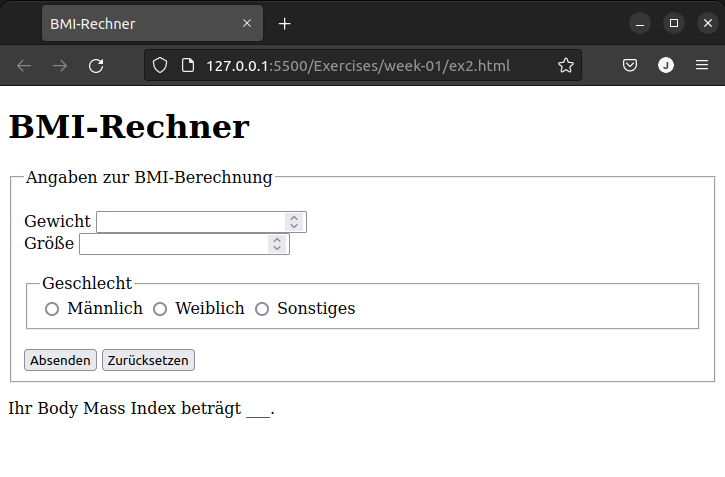

# Exercises week 01

## Exercise 1

Die "Responsive Web Design Certification" auf https://www.freecodecamp.org/ kann parallel zu diesem Kurs bearbeitet werden, um die Grundlagen auf eine weitere Art zu üben.

## Exercise 2

Erstelle und teste die unten gezeigte HTML-Seite mit einem Formular mit Hilfe einer IDE (Entwicklungsumgebung) wie WebStorm oder Visual Studio Code. Erzeuge dazu zunächst ein neues Projekt. Du brauchst Dir noch keine Gedanken um das Layout zu machen!

# Exercise 3

Erweitere Dein Formular von Aufgabe 2 um zwei weitere Eingabefelder für Benutzername und Email. Recherchiere dazu, welcher `type` sich für diese Felder am besten eignet, z.B. auf [developer.mozilla.org](https://developer.mozilla.org/en-US/docs/Web/HTML/Element/input). Nutze für alle Eingabefelder, wo möglich und sinnvoll, entsprechende HTML5-Elemente bzw. Attribute (z.B. `required`). Das Feld für Gewichtsangaben soll zudem den Namen "gewicht" (`name="gewicht"`) und das für die Größe den Namen "groesse" erhalten (Größenangabe in m)!

Ergänze das `<form>`-Tag dann noch um die folgende URL im Attribut `action`:

`<form action="https://vulcan.informatik.hs-fulda.de/bmi_berechnen.php" method="get">`

Bei korrekter Eingabe sollte nun nach Klick auf "Absenden" serverseitig durch das o.g. extern liegende PHP-Skript der BMI berechnet werden. Denke deshalb daran, einen echten `submit`- und `reset`-Button zu verwenden, damit das Absenden funktioniert.
