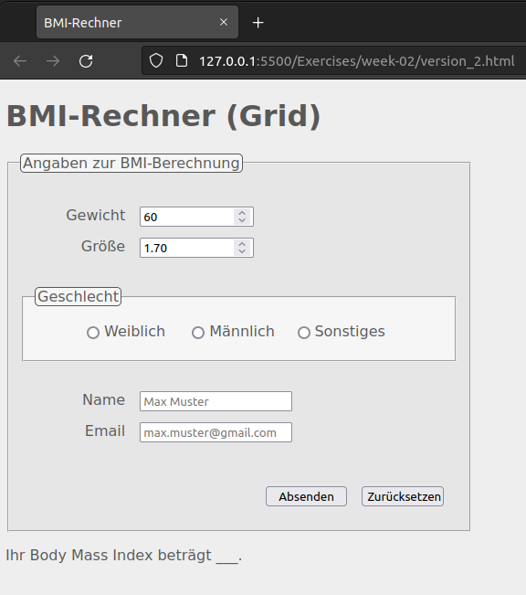

# Exercises week 02

## Exercise 1

Als begleitende Übung empfehlen sich wieder die interaktiven "Fingerübungen" von <https://www.freecodecamp.org/> ("Responsive Web Design Certification"). Nun kannst du dort auch die Übungen bearbeiten, die sich mit CSS befassen.

## Exercise 2 (Formular mit CSS stylen)

Style Dein Formular aus [Aufgabe 3 der letzten Übung](../week-01/README.md#exercise-3) mit Hilfe von CSS so, dass es ähnlich wie unten gezeigt aussieht. Die Rahmen kommen vom `<fieldset>`- und `<legend>`-Tag. Nutze ein externes Stylesheet, das Du mit Hilfe des `<link>`-Tags einbindest.

Tipps:

- Verwende im HTML-Dokument `
`-Tags zum Gruppieren mehrere HTML-Elemente, z.B. für jede "Zeile" des Formulars.
- `id`- und `class`-Namen kannst Du frei vergeben (und die jeweiligen Elemente mit den CSS-Selektoren ansteuern)
- Verwende zur äußeren Beschriftung der Input-Felder `<label>`-Tags, deren Eigenschaft `width` (oder auch `min-width`) Du setzen kannst, wenn `display: inline-block;` gesetzt ist. Zur inneren Beschriftung dient das Attribut `placeholder`.
- Zum Debuggen kannst Du allen Elementen eine andere Hintergrundfarbe (`background-color`) zuordnen. So siehst Du meist auf einen Blick, ob sich die gestylten Elemente bzgl. Position und Größe wie gewünscht verhalten.
- Zur Positionierung gibt es verschiedene Herangehensweisen (siehe auch die [Lösungsvorschläge](./index.html)):
  1. "klassische" Eigenschaften zum Positionieren sind `text-align`, `margin`/`margin-left`, `padding` und `float`.
  2. [`display: grid;`](https://developer.mozilla.org/de/docs/Web/CSS/CSS_Grid_Layout)
  3. [`display: flex;`](https://developer.mozilla.org/de/docs/Learn/CSS/CSS_layout/Flexbox)
