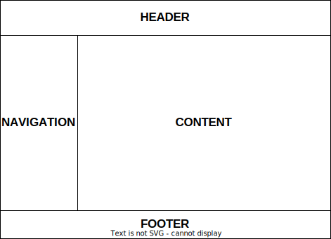
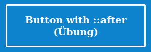
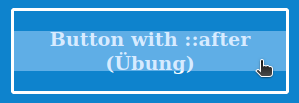
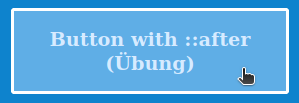

# Exercises week 03

## Exercise 1 (Seiteneinteilung mit CSS)

Gestalte mit CSS eine [barrierearme](https://developer.mozilla.org/en-US/docs/Web/Accessibility) Website mit Informationen zu einem von dir gewählten Thema z.B. Gesundheit oder Sport. Halte dich dabei an das unten gezeigte Layout mit den wichtigsten Elementen: Navigationsmenü, Hauptinhaltsbereich, Kopfbereich und Fußzeile. Realisiere das Layout ohne Frames und Tabellen.

Wenn das Browserfenster größer oder kleiner gemacht wird, soll sich der Inhaltsbereich (Content) vergrößern, aber das grundlegende Layout soll sich nicht verändern.

Tipp: zum Testen `lorem ipsum` Fülltext benutzen.



Du kannst dich dabei an folgendem HTML-Grundgerüst im `<body>` orientieren:

```html
<header>
  <h1>Layout</h1>
</header>
<aside>
  <nav>
    <ul>
      <li><a href="#">Page 1</a></li>
      <li><a href="#">Page 2</a></li>
      <li><a href="#">Page 3</a></li>
      <li><a href="#">Page 4</a></li>
    </ul>
  </nav>
</aside>
<main>
  <p>some content</p>
  <p>some content</p>
  <p>some content</p>
  <p>some content</p>
  <p>some content</p>
  <p>some content</p>
  <p>some content</p>
</main>
<footer>Footer</footer>
```

## Exercise 2 (Button-Animation mit CSS)

Das unten angegebene HTML-Grundgerüst erzeugt einen "Button" mit Hilfe von CSS-Formatierungen:



Ergänze das CSS, um den Pseudobutton so zu stylen, dass er beim Mouseover (hover) eine Animation ausführt. Innerhalb von ca. einer halben Sekunde soll dabei, von der Mitte ausgehend, der ganze Button blasser werden. Verlässt man den Button mit dem Mauszeiger, soll die Animation umgekehrt ablaufen.

Zwischenzustand beim Hovern:



Endzustand:



Nutze nur CSS zum Lösen der Aufgabe, der HTML-Code bleibt unverändert. Mit dem Selektor `a:hover` lassen sich zwar Start- und Endzustand realisieren, nicht jedoch die Übergangsanimation. Das CSS-Pseudoelement `::after` sowie folgende CSS-Eigenschaften könnten hilfreich sein: `transition`, `top`, `left`, `width`, `height` und `position: absolute`

```html
<html>
  <head>
    <style>
      body {
        background: #0e83cd;
      }
      a {
        display: block;
        margin: 2rem auto;
        padding: 1rem;
        max-width: 15rem;
        border: 3px solid white;
        border-radius: 3px;
        text-decoration: none;
        color: white;
        font-weight: bold;
        font-size: 1.2rem;
        text-align: center;
      }
      .vertical {
        position: relative;
      }
      .vertical::after {
        /* TODO */
      }
      .vertical:hover::after {
        /* TODO */
      }
    </style>
  </head>
  <body>
    <a href="#" class="vertical">Button with ::after (&Uuml;bung)</a>
  </body>
</html>
```
