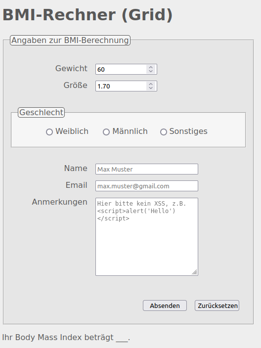

# Exercises week 04

## Exercise 1

Lies Dir zur Einführung in das Thema Javascript das Tutorial auf <https://wiki.selfhtml.org/wiki/JavaScript/Tutorials/Einstieg> durch, und zwar die Kapitel:

- [Erste Schritte](https://wiki.selfhtml.org/wiki/JavaScript/Tutorials/Einstieg/Erste_Schritte)
- [Programmieren und Debuggen](https://wiki.selfhtml.org/wiki/JavaScript/Tutorials/Einstieg/Programmieren_und_Debuggen)
- [Funktionen](https://wiki.selfhtml.org/wiki/JavaScript/Tutorials/Einstieg/Funktionen)

## Exercise 2 (Grundlagen)

1. Erstelle in Deiner IDE ein neues Projekt mit einer `.js`-JavaScript-Datei und einer `.html`-Datei. Binde in das HTML-Dokument die externe JavaScript-Datei ein. Gibzum Testen in der JavaScript-Datei den String "Hallo Web-Apps" mit Hilfe von `document.write()` aus.
2. Schreibe eine `for`-, eine `while`- und eine `do..while`-Schleife, welche jeweils die Zahlen 1 bis 10 ausgibt. Eine der Schleifen soll zusätzlich ausgegeben, ob die Zahl gerade oder ungerade ist. Achte auf eine lesbare Formatierung der Ausgabe!
3. Gib mit Hilfe einer `switch`-Anweisung, die den Wert von [`getDay()` des `Date`-Objekts](https://developer.mozilla.org/en-US/docs/Web/JavaScript/Reference/Global_Objects/Date/getDay) als Bedingung nimmt, den aktuellen Wochentag als String aus. Die Ausgabe soll mit Hilfe einer `alert()`-Box geschehen. Teste dein Programm für alle Wochentage.

## Exercise 3 (Funktionen)

1. Implementiere eine JS-Funktion, die zwei als Parameter übergebene Zahlen addiert und den Ergebniswert zurückliefert. Implementiere weiterhin eine Funktion, welcher zwei Strings als Argumente übergeben werden und die als Ergebnis die Konkatenation beider Strings zurückgibt.
2. Schreibe eine rekursive Funktion namens `summe(n)`, die für eine natürliche Zahl `n ≥ 0` die Summe aller Zahlen von `0` bis einschließlich `n` berechnet. Berücksichtige eventuelle Problemfälle!
3. Implementiere jeweils eine rekursive und eine iterative Funktion zur Berechnung der Fakultät einer natürlichen Zahl n (zur Erinnerung: 0! = 1).
4. Schreibe eine Funktion `pattern(numLines)`, die das nachfolgende Muster anzeigt. Die Anzahl der Zeilen, aus denen das Muster besteht, ist variabel und wird der Funktion mit Hilfe des Parameters `numLines` übergeben. Verwende für die Ausgabe das `<pre>`-Tag, damit das Muster korrekt mit Leerzeichen dargestellt wird.
   <pre>
      +
     +++
    +++++
   +++++++
   </pre>

## Exercise 4 (Arrays)

1. Nutze nun, statt einer `switch`-Anweisung wie in Aufgabe 2.3, zur Angabe des Tages die Rückgabe von `getDay()` als Index in ein entsprechend befülltes Array! (Gib zum Testen wieder den Wert aus und versuche es mit allen Wochentagen.)
2. Schreibe eine Funktion `generateRandomArray(a, b, n)`, die ein Array erzeugt und mit n zufälligen Zahlen aus einem selbstgewählten Intervall [a ,b] befüllt. a, b und n werden der Funktion als Argumente übergeben. Der Rückgabewert der Funktion ist das befüllte Array.
3. Erstelle eine Funktion `sumArray(arr)`, welche die Summe aller Elemente des als Argument übergebenen Arrays berechnet und zurückgibt (bitte alles immer auch testen).
4. Programmiere eine Funktion `groessteZahl(arr)`, welche die größte Zahl zurückgibt, die im Array `arr` gespeichert ist. Denke daran, dass das Array auch negative Zahlen beinhalten oder noch leer sein könnte.
5. Probiere anhand eines konkreten Beispiels, wie mehrdimensionale Arrays erzeugt und als Rückgabe-Wert einer JavaScript-Funktion zurückgeliefert werden können.

## Exercise 5 (Wiederholung Formulare)

Wie lautet der Query String, wenn Du Deinen Namen, Deine Größe etc. in Dein BMI-Formular aus der letzten Übung eingibst und das Formular durch Anklicken des Submit-Buttons absendest? Achtung: das `name`-Attribut des Namensfeldes soll dabei noch den Wert `uname` bekommen!

Ergänze Dein Formular außerdem noch um einen Bereich für Anmerkungen. Nutze dazu `<textarea>`, wie unten gezeigt, mit `name` "anmerk". Das Formular wird übrigens in dieser Form in einer der nächsten Aufgaben weiter ergänzt.

### Optional: Cross Site Scripting (XSS) Attacke ausführen

Spiele den Bösewicht und füge HTML oder sogar JavaScript-Code in die Textarea ein (z.B. um den User mit 50 Pop-Ups mittels der "beliebten" `alert()`-Box zu ärgern) und sende das Formular ab. Versuche des Weiteren programmatisch auf eine böse Reklameseite weiterzuleiten (z.B. durch Ändern des `window.location`-Objekts).

Teste das Ergebnis auf verschiedenen Browsern und sieh dir auch die Vorgänge (z.B. Netzwerk) über die Entwicklerkonsole an.
