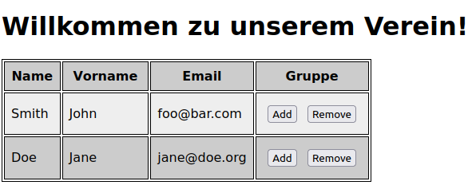

# Exercises week 05

## Exercise 1

Lies Dir das Tutorial auf <https://wiki.selfhtml.org/wiki/JavaScript/Tutorials/DOM> durch, und zwar alle Kapitel:

- [Einbindung in HTML](https://wiki.selfhtml.org/wiki/JavaScript/Tutorials/DOM/Einbindung_in_HTML)
- [Was ist das DOM?](https://wiki.selfhtml.org/wiki/JavaScript/Tutorials/DOM/Was_ist_das_DOM)
- [Ereignisverarbeitung](https://wiki.selfhtml.org/wiki/JavaScript/Tutorials/DOM/Ereignisverarbeitung)
- [DOM-Manipulation](https://wiki.selfhtml.org/wiki/JavaScript/Tutorials/DOM/DOM-Manipulation)

## Exercise 2 (Formulare und Events)


1. Berechne den BMI diesmal mit Hilfe von JavaScript entsprechend der Angaben in den relevanten Eingabefeldern! Klickt man auf den Button "BMI mit JS berechnen" (vgl. Screenshot), sollen die Unterstriche unten bei "Ihr Body Mass Index beträgt \_\_\_." durch den berechneten BMI ersetzt werden. Das Anklicken des Submit-Buttons "Absenden" soll wie gehabt funktionieren.

2. Zeichne für Deine Webseite mit dem BMI-Rechner-Formular nun den dazugehörigen DOM-Tree!

## Exercise 3 (DOM-Scripting)

In dieser Aufgabe gestaltest Du einen kleinen Webauftritt für einen Verein (eine einfache Startseite genügt) und erweiterst diesen um die Möglichkeit, dynamisch Vereinsmitglieder anzuzeigen und ggfs. für eine Sportgruppe auszuwählen.

Erstelle dazu zunächst ein JavaScript-Objekt, das für die Vereinsmitglieder Daten wie Vorname, Name und Email-Adresse enthält. Die einzelnen Objekte sollen dabei in einem Array gespeichert werden, wie im Folgenden gezeigt:

```javascript
let mitglieder = [
  {
    name: "Smith",
    vorname: "John",
    email: "foo@bar.com",
  },
  {
    name: "Doe",
    vorname: "Jane",
    email: "jane@doe.org",
  },
];
```

Füge Deinem HTML-Dokument einen Button "Mitglieder anzeigen" hinzu.


Klickt man darauf, soll der Button verschwinden und die Mitgliedsdaten sollen dabei in einer Tabelle angezeigt werden.



Dabei sollen gerade bzw. ungerade Tabellenzeilen zur besseren Lesbarkeit je eine leicht andere Hintergrundfarbe haben (z.B. mit [`:nth-of-type()`](https://developer.mozilla.org/en-US/docs/Web/CSS/:nth-of-type) oder [`:nth-child()`](https://developer.mozilla.org/en-US/docs/Web/CSS/:nth-child)).

Außerdem soll sich die Anzahl der Tabellenzeilen dynamisch aus dem Array ergeben, d.h. fügt man dem Array `mitglieder` ein weiteres Objekt hinzu und lädt die Seite neu, so wird in der Tabelle - ohne weiteren Code - eine zusätzliche Zeile angezeigt.

Mit den beiden Buttons in der letzten Spalte soll es möglich sein, Vereinsmitglieder für eine bestimmte Gruppe aus- bzw. abzuwählen. Das Mitglied wird sodann in einer zusätzlichen Bulletpoint-Liste (`<ul>`) unterhalb der Tabelle angezeigt.


Das Ein- und Austragen in diese Liste soll wieder dynamisch zur Laufzeit erfolgen und jedes Mitglied kann nur einmalig zur Gruppe hinzugefügt oder daraus entfernt werden!
