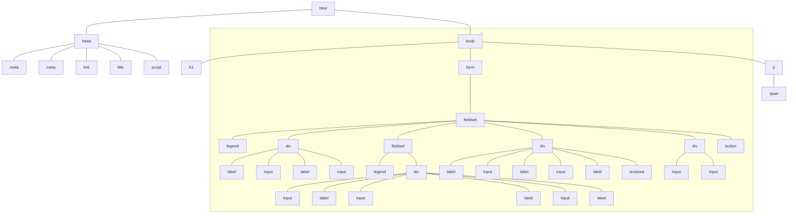

DOM-Tree des [BMI-Rechner-Formulars](./ex2.html) generiert mit [mermaid](https://github.com/mermaid-js/mermaid)

```mermaid
flowchart TD
    html --- head
        head --- meta1[meta]
        head --- meta2[meta]
        head --- link
        head --- title
        head --- script
    html --- body
        body --- h1
        subgraph _
        body --- form
            form ---- fieldset1[fieldset]
                fieldset1 --- legend1[legend]
                fieldset1 --- div1[div]
                    div1 --- label1[label]
                    div1 --- input1[input]
                    div1 --- label2[label]
                    div1 --- input2[input]
                fieldset1 --- fieldset2[fieldset]
                    fieldset2 --- legend2[legend]
                    fieldset2 --- div2[div]
                        div2 --- input3[input]
                        div2 --- label3[label]
                        div2 --- input4[input]
                        div2 --- label4[label]
                        div2 --- input5[input]
                        div2 --- label5[label]
                fieldset1 --- div3[div]
                    div3 --- label6[label]
                    div3 --- input6[input]
                    div3 --- label7[label]
                    div3 --- input7[input]
                    div3 --- label8[label]
                    div3 --- textarea
                fieldset1 --- div4[div]
                    div4 --- input8[input]
                    div4 --- input9[input]
                fieldset1 --- button
        end
        body --- p
            p --- span
```
