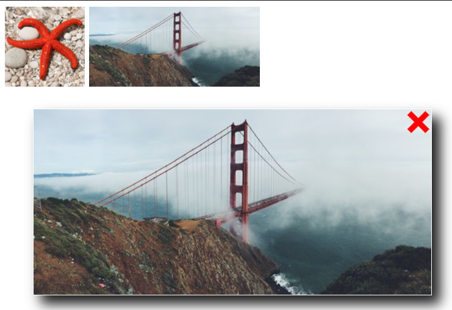

# Exercises week 06

## Exercise 1

- Implementiere ein interaktiv mit der Maus verschiebbares HTML-Element (z.B. ein `<div>`)
  - ohne Hilfsbibliotheken wie etwa jQuery
- Wie kann man HTML-Elemente positionieren?
  - folgende CSS-Eigenschaften sind nützlich:
    `position`, `top`, `left`, `z-index` (letzteres für Verdeckung)
- Auf welche Maus-Ereignisse muss man reagieren?

Der folgende Code versucht diese Aufgabe zu lösen. Leider enthält der Code noch etliche Fehler. Finde und korrigiere diese am Rechner (also wirklich ausprobieren und testen) und überlege, was dabei jeweils das Problem war. Ergänze außerdem eventuell fehlenden Code.

```html
<html>
    <head>
        <styl>
        #schiebbar {
        position: absolute; z-index: 1;
        width: 150px; height: 80px; left: 50px; top: 50px;
        background-color: #F6E3CE; border: 2px solid black;
        }
        </styl>
        <script>
            "use strict";
            var elem = document.getElementsById("myDiv");
            var dragging = false;
            var lastX, lastY;
            elem.addEventListener("onmousedown", function(evt) {
                dragging = true;
                lastX = evt.clientX;
                lastY = evt.clientY;
            }, false);
            elem.addEventListener("mousemove", function(evt) {
                if (dragging)
                    var style = window.getComputedStyle(elem, null);
                    var posx = parseInt(style.getPropertyValue("left");
                    var posy = parseInt(style.getPropertyValue("top"));
                    var x = evt.clientX;
                    var y = evt.clientY;
                    dx = x - lastX;
                    dy = y - lastY;
                    elem.style.left = posx + (dx + "px");
                    elem.style.top = (posy + dy) . " px";
                    lastX = x;
                    lastY = x;
                }
            }, false);
            elem.addEventListener("onmouseup", function(evt) {
                dragging = false;
            }
        </script>
    </head>
    <body>
        <div class="schiebbar" id="myDiv"></span>
    <body>
</html>
```

## Exercise 2



Erstelle eine Webpage mit mehreren Thumbnails (kleine Bilder). Beim Klicken auf ein solches Bild soll sich eine sogenannte [Lightbox](https://de.wikipedia.org/wiki/Lightbox) öffnen. In dieser soll eine große Version des Bildes angezeigt werden.

Die Lightbox soll ein **X** in der oberen rechten Ecke haben (siehe Abbildung). Beim Klicken auf **X** wird die Lightbox geschlossen. Nutze hierfür das `<a>`-Element in Kombination mit den CSS-Pseudoelementen `::before` und `::after`. Beim Klicken auf ein anderes Thumbnail bleibt die Lightbox geöffnet und das angezeigte Bild wird ausgetauscht.

Nachfolgend ist das HTML-Grundgerüst gegeben. Verändere dieses nicht und erzeuge alle Effekte mit CSS und JavaScript.

```html
<body>
  
  
  <div id="lightbox" class="hide">
    <a id="close" href="#"></a>
    
  </div>
  <script>
    // your code goes here
  </script>
</body>
```

_Mögliche Erweiterungen_:

1. Füge Pfeile in der Lightbox hinzu, um das nächste bzw. vorherige Bild zu laden.
2. Die Lightbox erscheint mit einem Fade-Effekt oder vergrößert sich via CSS.

## Exercise 3

Erstelle eine Webpage, auf der die zu ladenden Bilder initial mit Platzhaltern (über sog. Spinner, wie z.B. https://media.tenor.com/images/5f1c57a4f18059b1bb946df247f8561d/tenor.gif) angezeigt werden. Erst nachdem alle Ressourcen geladen wurden, sollen die eigentlichen Bilder nachträglich per Lazy Loading angezeigt werden.

Zur Erinnerung: Das Load-Event vom Window-Objekt feuert, wenn die Seite komplett geladen wurde.

_Tipp_: Benutze zum Testen im Reiter Network in den DevTools die Option zum Simulieren einer langsamen Internet-Verbindung (Throttling) und deaktiviere das Caching.

## Exercise 4

Traversiere (durchlaufe) ausgehend vom Wurzelelement `document` rekursiv den DOM-Tree Deiner Webseite mit dem BMI-Formular. Stelle diese Baumstruktur durch Angabe der gefundenen HTML-Elemente und Textknoten wie unten exemplarisch gezeigt dar. Die Hierarchiestufe lässt sich jeweils durch passendes Einrücken darstellen. Achte beim Durchlaufen des Baumes darauf, den DOM-Tree währenddessen nicht schon zu verändern, damit der Algorithmus auch terminiert.

```text
html
  head
    meta
    meta
    title
      #text (BMI-Rechner)
    script
  body
    h1
      #text (BMI-Rechner (Grid))
    form
      fieldset
        legend
          #text (Angaben zur BMI-Berechnung)
        div
          label
            #text (Gewicht)
          input 'gewicht'
          label
            #text (Größe)
          input 'groesse'
        fieldset
          legend
            #text (Geschlecht)
          div
            input 'female'
            label
              #text (Weiblich)
            input 'male'
            label
              #text (Männlich)
            input 'diverse'
            label
              #text (Sonstiges)
        div
          label
            #text (Name)
          input 'name'
          label
            #text (Email)
          input 'email'
          label
            #text (Anmerkungen)
          textarea
        div
          input ''
          input ''
        button
          #text (BMI mit JS berechnen)
    p
      #text (Ihr Body Mass Index beträgt)
      span
        #text (____)
      #text (.)
```
