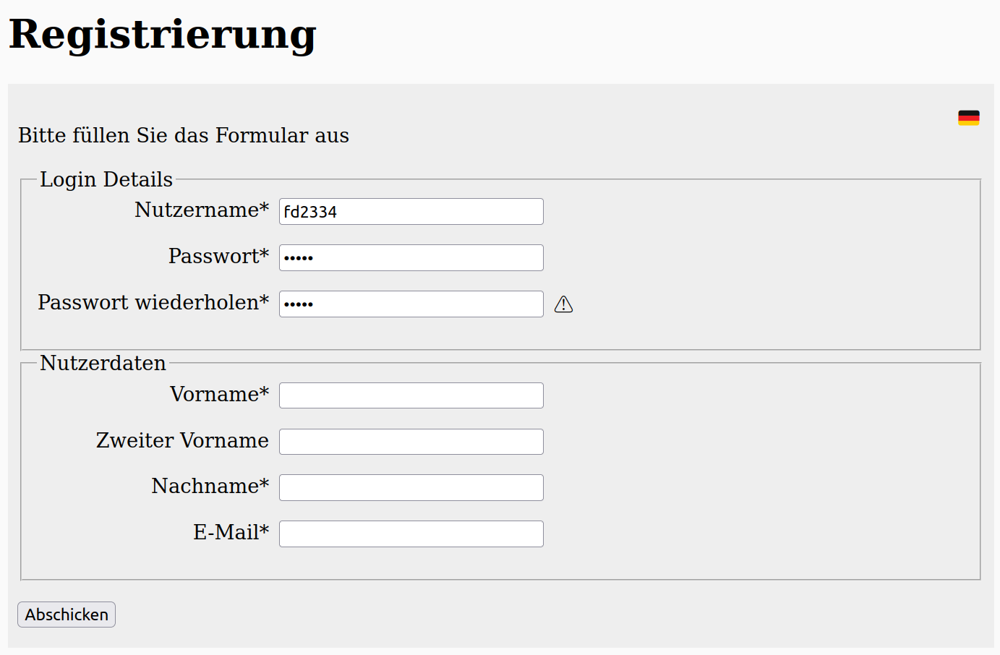
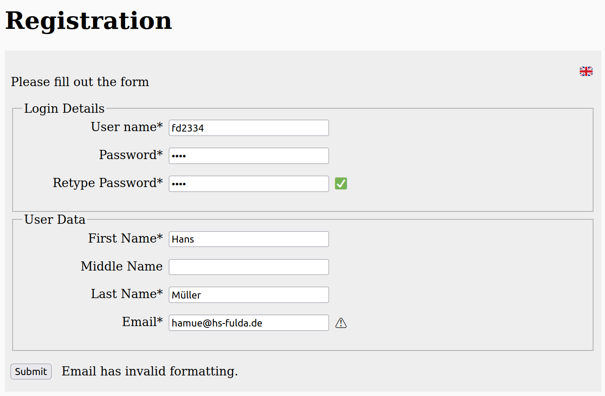

# Exercises week 07

## Exercise 1

Lies Dir nachfolgende Online-Tutorials durch:

- https://wiki.selfhtml.org/wiki/JavaScript/Objekte/RegExp
- https://wiki.selfhtml.org/wiki/JavaScript/DOM/Document/cookie
- Das Tutorial "JS JSON" auf https://www.w3schools.com/ – und zwar die folgenden acht Kapitel (jeweils über den "Weiter"-Button erreichbar):
  - [JSON Introduction](https://www.w3schools.com/js/js_json_intro.asp)
  - [JSON Syntax](https://www.w3schools.com/js/js_json_syntax.asp)
  - [JSON vs XML](https://www.w3schools.com/js/js_json_xml.asp)
  - [JSON Data Types](https://www.w3schools.com/js/js_json_datatypes.asp)
  - [JSON.parse()](https://www.w3schools.com/js/js_json_parse.asp)
  - [JSON.stringify()](https://www.w3schools.com/js/js_json_stringify.asp)
  - [JSON Object Literals](https://www.w3schools.com/js/js_json_objects.asp)
  - [JSON Arrays](https://www.w3schools.com/js/js_json_arrays.asp)

## Exercise 2

Überprüfe mit Hilfe eines regulären Ausdrucks vor dem Absenden ("submit") des BMI-Formulars (von Übungsblatt [4](../week-04/) und [5](../week-05/)) noch den angegebenen Namen auf Gültigkeit:

- Vor- und Nachname durch Leerzeichen getrennt
- nur Buchstaben
- keine Zahlen oder Sonderzeichen.

Für das Email-Feld genügt es, den input-Typ "email" zu wählen.

Überprüfe ebenfalls vor dem Absenden, ob das Anmerkungsfeld auch keine potentiell problematischen Inhalte enthält (also keinen HTML-Code). Verhindere in diesen Fällen, dass die Seite überhaupt zum Server abgeschickt wird und mache den Nutzer auf das Problem durch ein `alert()` aufmerksam. Teste u.a. wieder, indem Du versuchst, den Bösewicht zu spielen.

## Exercise 3

Überlege Dir eine Datenstruktur, welche alle Eingabedaten des obigen Formulars (Benutzername, Emailadresse usw.) sinnvoll repräsentiert. Wie lassen sich auf diese Weise mehrere Datensätze gleichzeitig darstellen (z.B. für Regina Müller, Peter Meier und Torsten Schmidt)?

Erstelle dafür exemplarisch je einen Datensatz mit Einträgen für mehrere Personen in XML sowie in JSON (beide als Datei abspeichern).

Teste anschließend auf gültiges JSON (z.B. mit <https://jsonlint.com>) bzw. auf wohlgeformtes XML (z.B. mit <https://www.xmlvalidation.com/>).

## Exercise 4

Bilde das gezeigte Formular mit Hilfe von HTML und CSS nach.

Für die genannten Symbole kannst du eigene Bilder nehmen oder diese HTML-Codes:

- Flagge Germany: `&#127465&#127466`
- Flagge UK: `&#127468&#127463`
- "OK"-Symbol: `&#x2705;`
- "Error"-Symbol: `&#x26A0;`

Ergänze das Formular mit den nachfolgenden Validierungen und Interaktionen:

- Durch Klicken bzw. Tippen auf das Fähnchen kann die Sprache des Formulars von Englisch auf Deutsch (und wieder zurück) geändert werden, ohne eine neue Seite zu laden.
- Nach Verlassen des Feldes "Retype Password" wird noch überprüft, ob das erneut eingegebene Passwort mit der Ersteingabe übereinstimmt.
  - bei Übereinstimmung erscheint neben dem Feld das "OK"-Symbol &#x2705;
  - bei Nichtübereinstimmung erscheint das "Error"-Symbol &#x26A0;
- Nach Verlassen des Email-Feldes wird überprüft, ob die eingegebene Adresse dem nachfolgend aufgeführten strikteren Format entspricht. Bei Übereinstimmung wird ebenfalls das "OK"-Symbol rechts neben dem Email-Feld angezeigt, bei Nichtübereinstimmung wird wieder das "Error"-Symbol angezeigt.
  - Emailadresse beginnt mit einem Kleinbuchstaben, gefolgt von
  - einer nicht-leeren Sequenz von Kleinbuchstaben oder Ziffern,
  - einem `@`-Symbol,
  - einer Sequenz von Kleinbuchstaben bestehend aus mindestens 2 Zeichen,
  - einem `.` (Punkt) sowie
  - zwei oder drei Kleinbuchstaben.
- Beim Abschicken des Formulars wird überprüft, ob alle obligatorischen Felder ausgefüllt sind und ob die obigen Kriterien alle erfüllt sind. Je nach Validierungsergebnis wird entweder eine Erfolgs- oder Fehlermeldung in der jeweils ausgewählten Sprache rechts neben dem Submit-Button ausgegeben.
