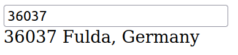

# Exercises week 08

## Exercise 1

Lies dir das JS-Ajax-Tutorial auf https://www.w3schools.com/ durch (jeweils über den "Weiter"-Button erreichbar):

- [AJAX Intro](https://www.w3schools.com/js/js_ajax_intro.asp)
- [AJAX XMLHttpRequest Object](https://www.w3schools.com/js/js_ajax_http.asp)
- [AJAX Request](https://www.w3schools.com/js/js_ajax_http_send.asp)
- [AJAX Response](https://www.w3schools.com/js/js_ajax_http_response.asp)
- [AJAX XML Example](https://www.w3schools.com/js/js_ajax_xmlfile.asp)
- [AJAX PHP Example](https://www.w3schools.com/js/js_ajax_php.asp)

## Exercise 2

In [Übung 5, Aufgabe 3](../week-05/ex3.html), wurde mit einem JavaScript-Objekt gearbeitet, das Mitgliederdaten enthält. Verändere diese Aufgabe nun dergestalt, dass die Vereinsmitglieder stattdessen aus einer JSON-Datei eingelesen werden.

Erstelle dazu ein JSON-File, welches für die Vereinsmitglieder wieder Daten wie
Vorname, Name und Email-Adresse enthält. Die Datei `mitglieder.json` sollte dabei wie
folgt aufgebaut sein:

```json
[
  {
    "Name": "Smith",
    "Vorname": "John",
    "Email": "foo@bar.com"
  },
  {
    "Name": "Doe",
    "Vorname": "Jane",
    "Email": "jane@doe.org"
  }
]
```

Klickt man nun auf den Button "Mitglieder anzeigen", soll nun `mitglieder.json` über XMLHttpRequest eingelesen und der Inhalt in ein gültiges JavaScript-Objekt verwandelt werden. Der Rest
der Aufgabe soll wie gehabt weiter funktionieren.

## Exercise 3

Füge Deiner BMI-Seite noch einen weiteren Button "BMI über Ajax holen" hinzu. Klickt man darauf, soll die Kommunikation mit dem Webserver mit Hilfe von Ajax erfolgen!

Baue Dir dafür zunächst einen Query-String für die beiden Eingabefelder namens `gewicht` und `groesse` mit deren aktuellem Wert und folgender Basis-URL zusammen:
`https://vulcan.informatik.hs-fulda.de/bmiRechnerAjax.php`

Sendet man damit einen Request (via `XMLHttpRequest` oder `fetch()`), so erhält man als Response vom Server das berechnete Ergebnis als Text zurück. Der Text soll via DOM-Scripting, wie bisher auch, statt der Unterstriche auf der BMI-Seite unten eingefügt werden.

## Exercise 4

Nutze die Google Maps API (insbes. den [Geocoding Service](https://developers.google.com/maps/documentation/javascript/geocoding)), um die zu einer Postleitzahl gehörende Adresse via `fetch()` asynchron abzufragen. Erstelle dazu ein Eingabefeld für die Postleitzahl. Beim Eintippen soll unter dem Eingabefeld automatisch während der Eingabe (also ohne Drücken eines Buttons) die gefundene Adresse bzw. der Ort angezeigt werden.



Wenn Du möchtest, kannst Du zudem noch weitere Informationen, wie die geographischen Koordinaten, mit ausgeben.

**Achtung**: Google verlangt einen API Key für den Zugriff auf die API. Um diesen zu erhalten, müssen für den Eigengebrauch – auch für die freie Version – leider [Kreditkarteninformationen hinterlegt werden](https://developers.google.com/maps/documentation/javascript/get-api-key). Für diese Übung kannst Du ggf. einen Key von der Übungsleitung bekommen (bitte für sonst nichts benutzen).

Nachfolgend ein Beispiel mit Schlüssel und URL auf die API, wobei der Query-Parameter für die PLZ usw. im Codegrundgerüst noch nicht eingetragen ist.

```html
<body>
  <input id="postalCode" type="text" placeholder="PLZ, z.B. 36037" />
  <div id="address">Some address</div>
  <script>
    const googleApiKey = "ADD API KEY HERE";
    const apiUrl =
      "https://maps.googleapis.com/maps/api/geocode/json?key=" +
      googleApiKey +
      "&components=postal_code:";
    let fetchData = {
      mode: "cors", // try this with mode: cors and mode: no-cors
    };

    // TODO; implement described functionality here!
  </script>
</body>
```
