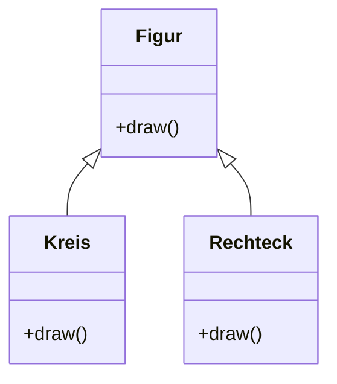

# Exercises week 09

## Exercise 1

Lies folgende Tutorials:

- https://developer.mozilla.org/de/docs/Web/JavaScript/Introduction_to_Object-Oriented_JavaScript (Konzepte und ES5-Syntax)
- https://developer.mozilla.org/de/docs/Web/JavaScript/Reference/Klassen (ohne die beiden Unterkapitel "Species" und "Mix-Ins")
- https://developer.mozilla.org/en-US/docs/Web/JavaScript/Closures

## Exercise 2 (Prototypische Vererbung)

Der folgende Codeausschnitt enthält einige syntaktische und semantische Fehler. Finde und korrigiere diese zunächst. Überlege, was die vier ganz unten stehenden Methodenaufrufe je ausgeben. Überprüfe Deinen Korrekturvorschlag, indem Du den verbesserten Code auch ausführst und testest! (Wenn Du möchtest, "übersetzen" anschließend noch den Code in ES6-Syntax.)

```javascript
"use strict";

var Hund = function(name, besitzer) {
    this._name = name;
    this._besitzer = besitzer;
};

Hund.prototype.bellen = function() {
    console.log(this._name + " sagt: Wau wau wau!");
};

Dackel = function(name, besitzer, club) {
    Hund.call(this, name);
    this._club = club;
};

Dackel.prototype = Hund();
Dackel.prototype.constructor = Dackel;

Dackel.sageSpruch = function() {
    console.log(this._besitzer + " sagt: Ordnung muss sein!");
};

var Boxer = function(name, besitzer, bissig) {
    Hund(name, besitzer);
    _bissig = bissig;
};

Boxer.prototype = Object.create(Hund);
Boxer.prototype.constructor = Boxer;

Boxer.prototype.nenneBeissverhalten = function() {
    var prop = this._bissig ? "bissiger" : "lieber";
    console.log("Ich bin ein " . prop . " Hund.")
};

var waldi = new Dackel("Waldi", "Krause", "Teckel e.V.");
var prinz = new Boxer("Prinz", "Klitschko", "KGB", false);

waldi.bellen();
waldi.sageSpruch();

prinz.bellen();
prinz.nenneBeissverhalten;
```

## Exercise 3 (Objekt und Klassen)

**Hinweis**: Nutze für diese und die nächste Aufgabe entweder die _old-school_ ES5-Variante (wie in Teilaufgabe 2) oder aber die neue ES6-Syntax (mit `class` usw.).

1. Definiere eine Klasse Rechteck mit den Eigenschaften `top`, `left`, `width`, `height` und `color`. Alle Attribute müssen durch den Konstruktor erzeugt und sinnvoll initialisiert werden, also gültige Pixelpositionen für (`top`, `left`) mit passender Größe (`width`, `height`) sowie Objektfarbe.
2. Weiterhin soll die Rechteck-Klasse mindestens noch eine Methode `draw(context)` zum Zeichnen des Rechtecks besitzen (Parameter `context` ist der sog. 2D-Context von [`<canvas>`](https://developer.mozilla.org/en-US/docs/Web/HTML/Element/canvas)).
3. Teste Deine Implementierung durch die folgenden Arbeitsschritte:
   - Erzeuge von Rechteck zunächst eine Instanz, die mit Hilfe des `<canvas>`-Elements durch Aufruf von `draw(context)` an der gespeicherten Position gezeichnet wird.
   - Füge dem `<canvas>` einen `click`-Eventhandler hinzu, sodass durch Klicken zusätzliche Rechtecke an der Klickposition mit zufälliger Größe (und ggf. Farbe) angezeigt und gespeichert werden. **Hinweis**: das im Event-Handler übergebene Event-Objekt liefert die Mausposition in Canvas-lokalen Koordinaten in den Attributen `layerX` und `layerY`.
   - Die Rechtecke sollen dazu in einem Array gehalten werden, sodass man das ganze Bild (über einen Button "Bild löschen") löschen und (über einen weiteren Button "Bild neuzeichnen") wiederherstellen kann.
4. _Zusatzaufgabe_: Animiere die Rechtecke (z.B. dergestalt, dass sie sich bei Klick auf einen weiteren Button innerhalb der Zeichenfläche auf einer beliebigen Bahn umherbewegen).

## Exercise 4 (Vererbung)



1. In einem Malprogramm gibt es neben Rechtecken auch andere 2D-Figuren wie etwa Dreiecke oder Kreise. Überarbeite Deinen Entwurf aus Aufgabe 3 entsprechend dem oben abgebildeten Klassendiagramm (nutze dazu Vererbung).
2. Teste Deine Vererbungshierarchie, indem Du zunächst je eine Instanz von Kreis und von Rechteck erzeugst. Implementiere dazu eine Testausgabe im Konstruktor, welche relevante Informationen zum Objekt ausgibt.
3. Zeichne die 2D-Objekte nun wieder mit Hilfe von `<canvas>` durch Aufruf der Methode `draw(context)`. Dabei soll das interaktive Zeichnen der Rechtecke mit der von der Basisklasse Figur abgeleiteten Rechteck-Klasse wie gehabt funktionieren, wobei das oben erwähnte Array nun genauso auch die zu zeichnenden Kreise halten soll. **Hinweis**: Zeichnen eines Kreises um Punkt (x, y) mit Radius r: `context.arc(x, y, r, 0, 2 * Math.PI, true)`

## Exercise 5 (Closures)

Erstelle dynamisch zwanzig Buttons, denen Du beim Erzeugen in einer Schleife einen Eventhandler für das `click`-Event zuweist. Beim Anklicken soll die Zählvariable zur Erstellungszeit ausgegeben werden, z.B. mit folgendem Text: "Button 12 wurde gedrückt".

Alternativ kannst Du auch [Übung 5.3](../week-05/ex3.html) bzw. [8.2](../week-08/ex2.html) so umschreiben, dass der Index in das Array sowie das Array mit den Adressdaten selbst im `click`-Handler mit Hilfe einer Closure zur Verfügung steht, sodass Du nicht mit `id`-Strings, globalen Variablen o.ä. arbeiten musst.
