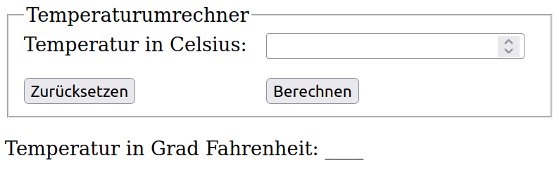

# Exercises week 10

## Exercise 1

Arbeite die ersten acht Unterkapitel des Node.js-Tutorials bis inkl. "Node.js NPM" auf <https://www.w3schools.com/nodejs/> durch.

## Exercise 2 (Node.js)

1. Installiere zunächst [Node.js](https://nodejs.org/). Erstelle eine Node.js-Testanwendung, die "Hello World" ausgibt und führe diese mit Deiner Node.js-Installation aus!
2. Erstelle nun ein weiteres Node.js-Skript, welches den BMI berechnet, wobei die sich aus den Formularfeldern ergebenden Name-Wert-Paare per GET übergeben werden sollen. Ändere zum Testen den Wert des Attributs `action` des `<form>`-Elements Deiner BMI-Seite auf den Namen bzw. die URL Deines Skriptes, sodass sich die Anwendung wie schon in [Übung 1.3](../week-01/index.html) verhält, nur jetzt mit Deinem eigenen Skript.
3. In [Übung 8.3](../week-08/ex3.html) solltest Du den BMI via Ajax holen. Ersetze jetzt das dort angegebene PHP-Skript gegen Dein eigenes Node.js-Skript, welches basierend auf Gewicht und Größe den errechneten BMI als String zurückgibt. Achte darauf, keine komplette HTML-Seite zu generieren, sondern den Request wirklich nur mit dem Ergebnisstring zu beantworten.

   **Hinweis:** Wenn Du zwei verschiedene Projekte (mit je anderem Port) nutzt, musst Du die Ajax-Anfrage explizit erlauben, z.B. indem Du im Node.js-Skript wie folgt den CORS Header setzt: `result.setHeader('Access-Control-Allow-Origin', '*');`

## Exercise 3 (PHP)

Installiere XAMPP und löse dann Aufgabe 2 noch mit PHP. Die CORS-Problematik löst man hier mit folgender erster Zeile im PHP-Skript: `header("Access-Control-Allow-Origin: *");`

## Exercise 4 (Serverseitige Verarbeitung mit Node.js)

1. In [Übung 7.2](../week-07/ex2.html) hast Du bei Deiner BMI-Seite clientseitig Benutzernamen und Anmerkungen mit Hilfe von regulären Ausdrücken auf Gültigkeit getestet. Diese Überprüfung sollte man sicherheitshalber auch serverseitig durchführen!
   Erweitere obige Aufgabe 2.2 so, dass Du zusätzlich zum berechneten BMI noch den Namen und die Anmerkungen des Benutzers ausgibst, vorausgesetzt es ist kein Schadcode enthalten (dazu wieder auf HTML-Syntax testen). Andernfalls gibst Du eine Warnmeldung aus.
2. Ergänze diese Aufgabe noch dahingehend, dass die an den Server gesendeten Daten dort im [CSV-Format](<https://de.wikipedia.org/wiki/CSV_(Dateiformat)>) abgespeichert werden. Bei jeder neuen Anfrage sollen die an Deinen Node.js-Server übermittelten Daten hinten an die CSV-Datei `userdata.csv` als neue Zeile angehängt werden, wobei die einzelnen Einträge (also Name, Email, Gewicht, Größe, Geschlecht und ggfs. Anmerkungen) je durch Semikolon voneinander getrennt werden sollen.

   CSV-Beispiel-Zeile: `Peter Petersen;pp@provider.de;80;1.78;m;-`

   **Hinweis:** Wenn Du die Live-Server Extension verwendest, solltest du dort in den Einstellungen unter "Ignore Files" `"**/*.csv"` hinzufügen. Damit verhinderst Du, dass beim Verändern/Schreiben der CSV-Datei die Seite im Browser neu geladen wird.

## Exercise 5 (Web-App mit Node.js)

Implementiere mit Hilfe von JavaScript und Ajax eine Webanwendung zum Umrechnen von Temperaturen (s. Abb.). Dabei wird bei Klick auf den Button "Berechnen" über Ajax per GET ein Node.js-Script aufgerufen, welches den umzurechnenden Temperaturwert in einem `<input>`-Element mit `name="celsius"` erwartet.
Der in Fahrenheit umgerechnete Wert wird direkt auf der HTML-Seite (statt der Unterstriche) angezeigt, ohne dabei die Seite vollständig neu zu laden.
